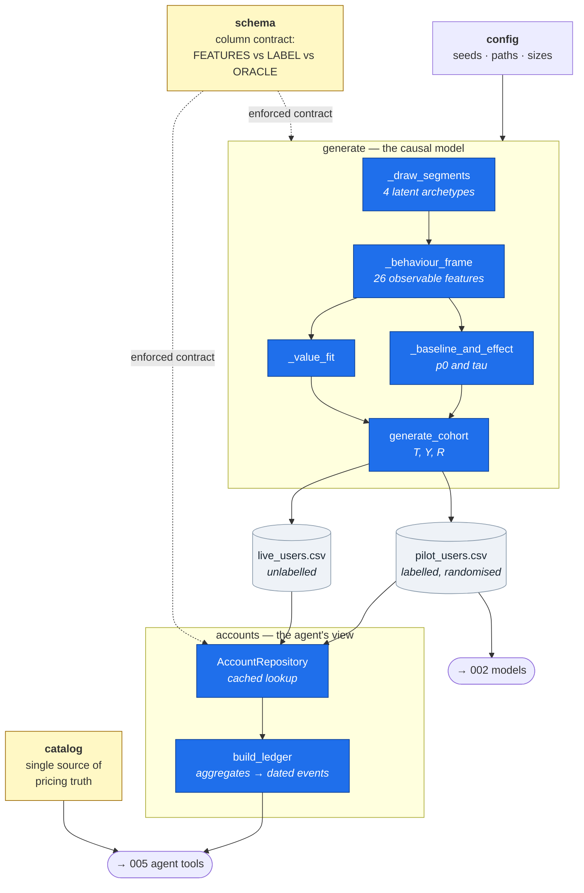
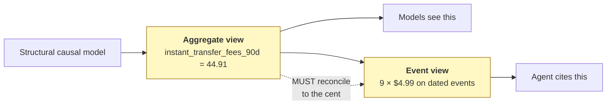

# HLD 001 — Synthetic Data Foundation

**Domain**: A · **Spec**: [001](../../../specs/001-synthetic-data-foundation/spec.md) · **Status**: Implemented

## Responsibility

Produce the population every other feature is validated against, with a property no real dataset
can offer: **the true per-user treatment effect is known.** Also produce event-level detail that
reconciles exactly to the aggregates the models consume, and centralise pricing facts so exactly
one file can state a price.

## Component decomposition

## Interface contracts

| Consumer | Contract | Guarantee relied upon |
|---|---|---|
| 002 models | `pilot_users.csv` + `schema.FEATURES` | No label or oracle column is in `FEATURES` |
| 003 policy | `live_users.csv` | Same feature columns as pilot, labels sentinel-valued |
| 005 agent tools | `build_ledger(user_id)` | Events reconcile to aggregates to the cent; stable across calls |
| 005 guardrails | `catalog.get_catalog()` | Only sanctioned source of prices and fee amounts |
| 009 fairness | `income_band` column | Correlated with segment, so gaps are real and detectable |

## Data flow — why two views must agree

If these diverged, the model would score a user on $44.91 of fees while the agent told them about
$39.92 — the same user, two stories. Reconciliation is enforced by *construction* (fee events are
emitted from the same counts that produced the aggregate; subscription prices are rescaled to the
aggregate) rather than checked afterwards, so the inconsistent state is unreachable.

## Failure modes

| Failure | Detection | Response |
|---|---|---|
| Missing cohort CSVs | `repository()` raises on load | Error names `python -m f2g.data.generate` |
| Unknown user id | `build_ledger` raises `KeyError` | Distinguishable from "user has no fees" — never an empty ledger |
| Aggregate/detail drift | pytest reconciliation over a large sample | Build fails |
| Oracle leakage into features | pytest asserts set disjointness | Build fails |
| `p0 + tau` outside [0,1] | `tau` clipped at generation | Unreachable by construction |

## Key decisions

1. **Segments are latent.** Exposing the archetype as a feature would make uplift modelling a
   lookup and prove nothing.
2. **Ledgers are derived, not stored.** Any user id works, including one invented during a demo,
   and there is no fixture that can drift.
3. **Retention depends on value fit, mediated by whether the nudge caused the conversion.** This is
   what gives the counter-metric teeth and makes [ADR-004](../../adr/ADR-004-value-fit-gate.md)
   demonstrable rather than asserted.
4. **One pricing module.** Makes the grounding guardrail auditable against a single file.
