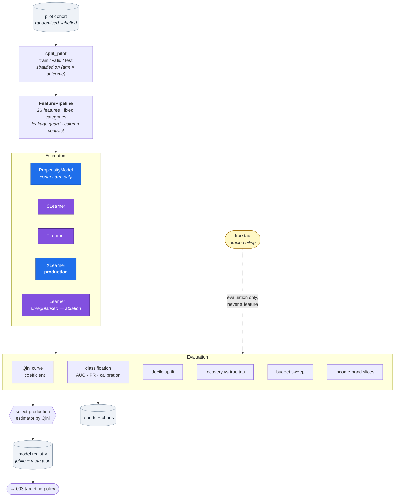
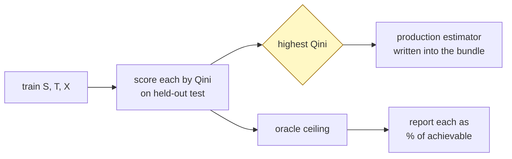
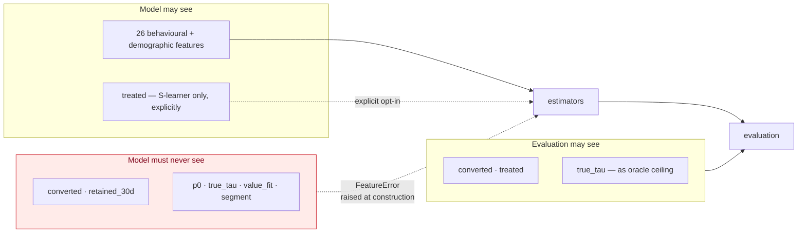

# HLD 002 — Propensity & Uplift Models

**Domain**: B · **Spec**: [002](../../../specs/002-propensity-uplift-models/spec.md) · **Status**: Implemented

## Responsibility

Turn the labelled pilot cohort into two decision signals — conversion likelihood and
incremental treatment effect — and produce the evidence that the second is worth its extra
complexity. Persist both with enough metadata to serve and audit them.

## Component decomposition

## Interface contracts

| Contract | Shape | Guarantee |
|---|---|---|
| `FeaturePipeline.transform(df)` | frame → frame, fixed column order | No label/oracle column can be present; unseen categories become NaN, never a shifted code |
| `PropensityModel.predict_proba(df)` | frame → `float[n]` in (0,1) | Calibrated to within 0.01 mean absolute decile gap |
| `*.predict_uplift(df)` | frame → `float[n]`, signed | Never clipped at zero — the negative region is what the policy acts on |
| `ModelBundle.load(name)` | name → estimator + metadata | Raises if the feature contract disagrees with the current pipeline |
| `artifacts/reports/model_evaluation.json` | JSON | Every number in the markdown report is derived from this file |

## The selection loop

Hard-coding the estimator would have shipped the T-learner, which measured *worse than the
propensity baseline*. Selecting by Qini is what let the system correct itself — so the loop
above is a design feature, not scaffolding.

## Data flow and the leakage boundary

The exclusion is enforced at pipeline construction, not at review time. Passing `true_tau`
as a feature raises before a single row is read.

## Failure modes

| Failure | Detection | Response |
|---|---|---|
| Oracle leakage into features | `FeatureError` at construction + test | Unconstructable |
| Column order drift between train and serve | `validate_against` on load | Raises, naming both differences |
| Degenerate arm (too few positives) | Guard in `TLearner.fit` | Raises rather than fitting noise that looks like an effect |
| Over-dispersed uplift | Live ablation + dispersion table each run | Visible in the report; pinned by a test |
| Near-zero denominator in a ratio | `MIN_RATIO_DENOMINATOR` guard | Ratio suppressed to NaN; pp difference always reported |
| Missing model at serve time | `FileNotFoundError` naming `f2g.ml.train` | Startup fails loudly |

## Key decisions

1. **Production estimator chosen by measurement**, re-decided on every training run.
2. **Oracle ceiling reported** so an absolute Qini becomes a share of what is achievable.
3. **The failed estimator is retained as a live ablation**, not deleted — the reason for the
   current design is recomputed rather than remembered.
4. **Separate hyperparameter sets** for outcome fitting and effect estimation, because they
   are different problems at signal scales an order of magnitude apart.
5. **Propensity is kept and scored**, giving an honest strong baseline (`corr(p̂, τ) = 0.24`
   on this population) rather than a straw man.
