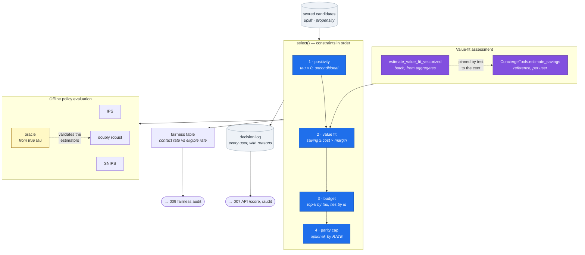
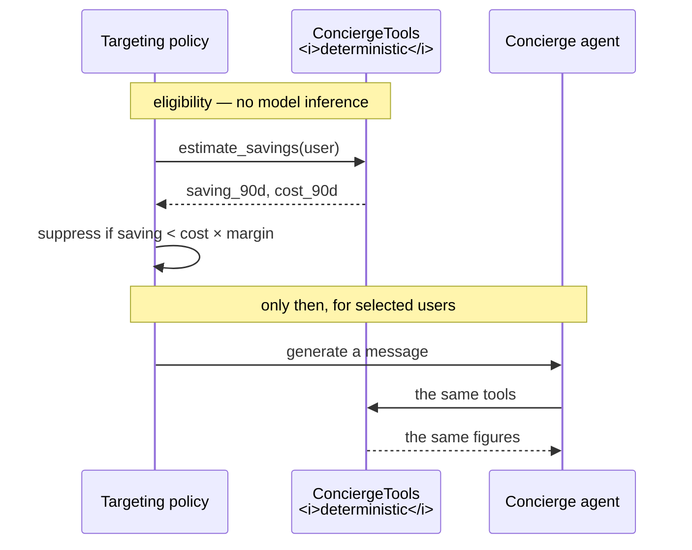

# HLD 003 — Targeting Policy Engine & Offline Policy Evaluation

**Domain**: B · **Spec**: [003](../../../specs/003-targeting-policy-engine/spec.md) · **Status**: Implemented

## Responsibility

Convert a per-user effect estimate into a decision that can be defended to a user, an analyst
and a regulator — and estimate what that decision would have achieved before it ships.

## Component decomposition

## Why the constraints are ordered this way

The order is load-bearing, not incidental.

**Positivity first**, because contacting someone whom contact harms is not a budget question.

**Value fit before budget.** If the budget ran first, a user could be excluded for ranking
poorly and the gate would never evaluate them — the suppression log would show `budget` where
the truthful answer is `value_fit`, and the fairness report would understate how often the gate
binds. Running the gate first means the log records the *real* reason and the freed slots are
visibly redistributed.

**Parity last**, because it should only ever trim a selection the other constraints already
approved.

## The coupling to the agent layer

The gate calls the **tool layer**, not the agent. Three consequences: it needs no inference, so
it runs over 12,000 users in seconds; it is exactly reproducible; and the number that decides
eligibility is the same number the user is later shown — the decision and the explanation
cannot disagree.

## Interface contracts

| Contract | Guarantee |
|---|---|
| `select(candidates, uplift, propensity, cfg, value_fit) → PolicyResult` | Deterministic; ties broken by `user_id` |
| `PolicyResult.decisions` | One row per candidate, every row carrying a decision and a reason |
| `PolicyResult.summary["binding_constraint"]` | Which constraint actually bound, not which was configured |
| `estimate_value_fit_vectorized(frame)` | Agrees with the per-user tool path to the cent |
| `evaluate_policy(frame, pi, mu0, mu1) → DataFrame` | One row per estimator, each with an interval |

## Failure modes

| Failure | Detection | Response |
|---|---|---|
| Every candidate has negative uplift | Empty eligible set | Return empty; never contact the "least bad" to fill a budget |
| Gate suppresses more than the budget | `len(eligible) <= n_budget` | Report `value_fit` as the binding constraint and the budget underuse |
| User has no account data | `has_data` false | Fails the gate — absence of evidence is not evidence of benefit |
| Extreme importance weights in OPE | Weight clipping | Clip at a recorded threshold and report the clipped fraction |
| Fast value-fit path drifts from the agent | `test_value_fit_paths_agree` | Build fails |

## Key decisions

1. **The gate is a constraint, not a feature.** A feature can be traded off against others; a
   constraint cannot. That difference is the entire point.
2. **Parity caps by rate, not count.** Capping counts across bands of unequal size equalises the
   wrong quantity and measurably widened the gap it was meant to close.
3. **The oracle is reported beside the estimators.** It validates the estimator rather than the
   policy — the one check synthetic data uniquely permits.
4. **Both sides of the gate are always reported.** Users suppressed, conversions forgone, mean
   benefit with and without. A trade reported in one direction only is advocacy.
