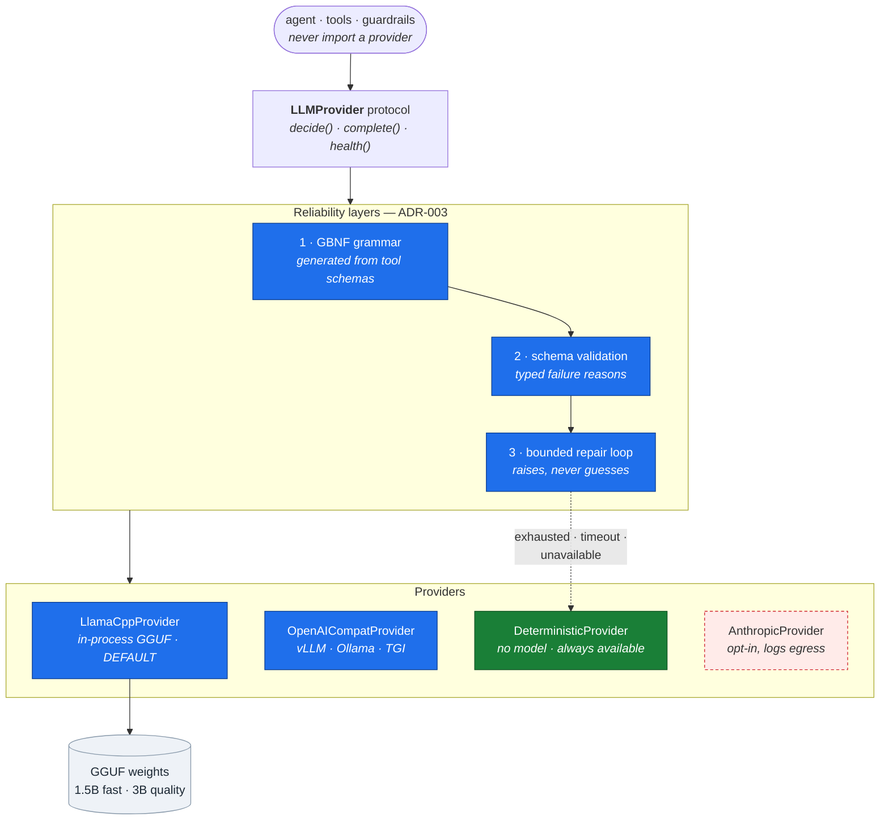
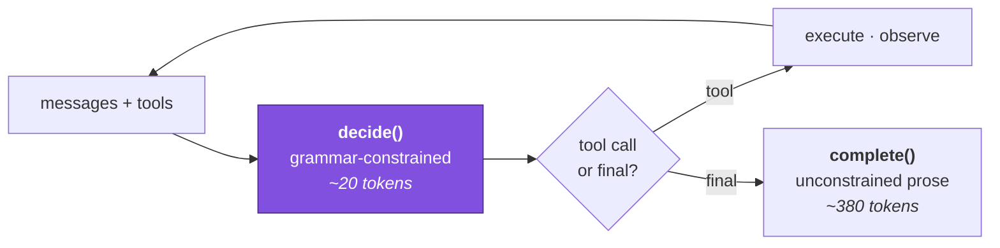

# HLD 004 — Local LLM Runtime & Provider Abstraction

**Domain**: C · **Spec**: [004](../../../specs/004-local-llm-runtime/spec.md) · **Status**: Implemented

## Responsibility

Run an agent on open-weights models inside our own trust boundary, and make tool calling
reliable enough to build a product on despite the model being small.

## Component decomposition

## The decide/complete split

Splitting these is what makes a 1.5B model usable. Asking it to emit long prose *inside* a
grammar-constrained JSON string — with correct escaping — fails often. Asking it to emit twenty
constrained tokens choosing a tool, then separately to write prose with no constraint, plays to
what it can actually do.

## Interface contracts

| Contract | Guarantee |
|---|---|
| `decide(messages, tools) → Decision` | A validated call naming a registered tool, or `is_final`; never a half-parsed guess |
| `complete(messages) → Completion` | Free text plus telemetry |
| `health() → dict` | Availability **and** an `egress` statement |
| `build_provider(name)` | Fails at construction on an unknown name or missing weights |
| Every result | Carries provider, model, tokens, latency, repair attempts, degraded flag |

## Failure modes

| Failure | Detection | Response |
|---|---|---|
| Malformed JSON | Impossible under grammar; parser otherwise | Recover the outermost brace span, else reject |
| Unknown tool / parameter / type / enum | Schema validation | Typed reason → specific repair instruction |
| Repairs exhausted | Attempt counter | `RepairBudgetExhausted`; caller degrades |
| Generation exceeds the budget | Wall clock in an executor | `GenerationTimeout`; degrade |
| Weights absent | Path check at construction | Error naming `make models` and the deterministic alternative |
| Model loops on one call | `repeated_call` signature match | Surfaced to the agent so it can stop |
| Unsupported JSON Schema construct | Grammar generation | `GrammarUnsupported` **at registration**, never at decode |

## Two operational realities, stated rather than hidden

**Concurrency.** A single llama.cpp context is not safe for concurrent use, so access is
serialised behind a lock. That is a real single-process throughput ceiling.

**Cancellation.** The binding offers no way to interrupt generation in flight. The timeout
*abandons* rather than cancels: the caller gets `GenerationTimeout` promptly and degrades, while
the worker finishes in the background and releases the lock. Work is bounded by `max_tokens`, so
it always terminates. Claiming we can cancel would be worse than saying we cannot.

## Measured on this machine

| | 1.5B (fast) | 3B (quality) |
|---|---|---|
| Load | 1.3 s | ~3 s |
| Throughput, 4 CPU threads | 16.4 tok/s | ~9 tok/s |
| Tool-call syntactic validity under grammar | 100% | 100% |
| Tool **selection** — the honest metric | weaker; both tiers skipped the fee ledger | see 005 |

The grammar guarantees the call is *well formed*. It cannot guarantee it is the *right* call,
and the two are reported separately for exactly that reason.
