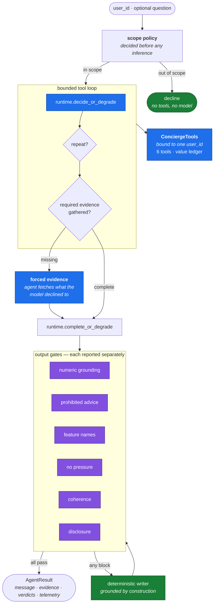
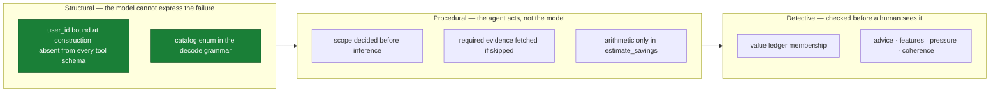
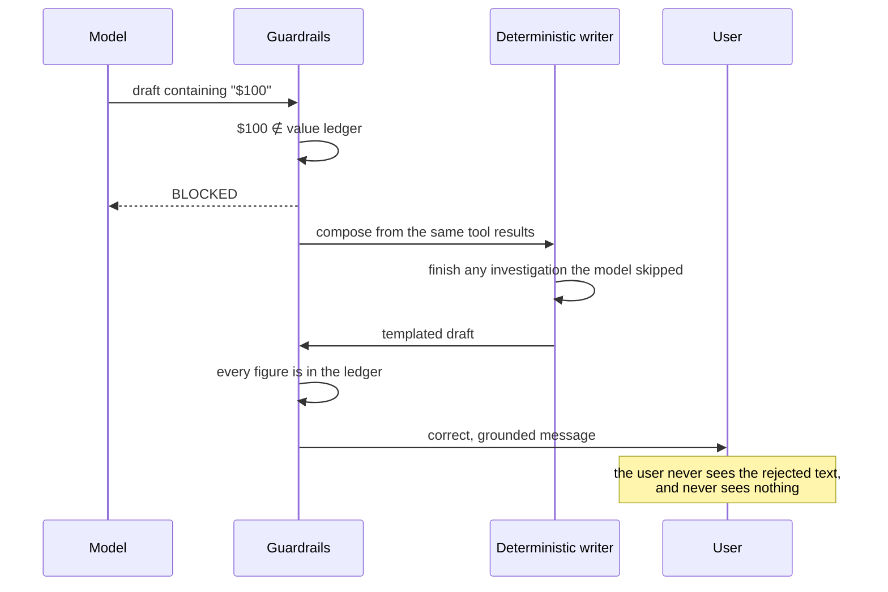

# HLD 005 — Genius Concierge Agent & Safety Guardrails

**Domain**: C · **Spec**: [005](../../../specs/005-concierge-agent-guardrails/spec.md) · **Status**: Implemented

## Responsibility

Produce a specific, true, per-user explanation of whether a paid subscription would save this
person money — built on the assumption that **the model will sometimes be confidently wrong**,
and designed so that being wrong cannot reach a user.

## Component decomposition

## The three defences, and why each exists

Structural beats procedural beats detective, so the design reaches for the leftmost available
option each time. Prompt instructions appear nowhere on this diagram: they reduce how often
gates fire, they are not controls.

## Interface contracts

| Contract | Guarantee |
|---|---|
| `ConciergeAgent(user_id, provider=None)` | Raises on an unknown user; identity fixed for the session |
| `.generate_nudge() → AgentResult` | Message plus tool calls, evidence, per-check verdicts, telemetry |
| `.chat(text) → AgentResult` | Same, and out-of-scope questions decline without touching account data |
| `AgentResult.evidence[i].tools` | Provenance for every figure — the console's chip contract |
| `AgentResult.guardrails["checks"]` | One boolean per check, never one aggregate |
| `AgentResult.degraded` / `forced_evidence` | Degradation and under-investigation are visible, not silent |

## Failure modes

| Failure | Control | Result |
|---|---|---|
| Invented figure | Value-ledger membership | Blocked; degrade to the template |
| Invented feature | Grammar enum + name check | Unrepresentable; blocked if paraphrased |
| Model does arithmetic | Grounding blocks derived numbers | Deliberate false positive; `estimate_savings` is the answer |
| Out-of-scope advice | Scope policy, pre-inference | Declined in one sentence |
| Injection | Identity bound structurally | Nothing to redirect; attempt logged |
| Answering without looking | Required-evidence precondition | Agent fetches it and records `forced_evidence` |
| Repetition loop | Coherence check | Blocked; degrade |
| Model calls one tool forever | Round cap + repeat detection | Forced to answer |
| All drafts blocked | Deterministic writer, then a safe refusal | Never an unchecked message |

## The degradation path is the design

A blocked message is not an error state. The user gets a correct explanation and we get a logged
reason — which is precisely what makes a strict, absolute grounding gate affordable.

## Key decisions

1. **Identity is structural.** The single most important line in the feature is that `user_id`
   is a constructor argument, not a tool parameter.
2. **Refusal does not depend on the model.** Scope is decided in the agent, so every provider
   declines identically, for free.
3. **Evidence gathering is a protocol precondition.** Both model tiers answered from
   `get_account_summary` alone and reached confident wrong conclusions. The prompt asks; the
   loop enforces.
4. **Every check reports independently.** A composite pass/fail tells an operator something
   broke without saying what, and the per-check block rate is what detects prompt drift.
