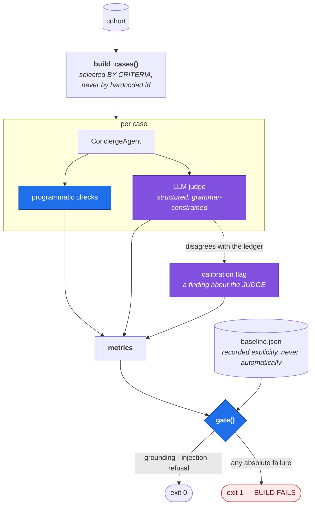
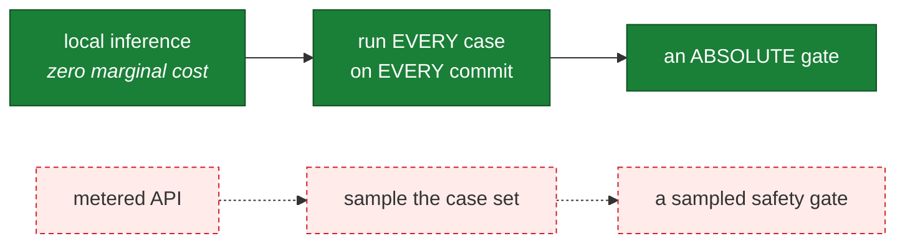

# HLD 006 — Agent Evaluation Harness & CI Gate

**Domain**: C · **Spec**: [006](../../../specs/006-agent-evaluation-harness/spec.md) · **Status**: Implemented

## Responsibility

Turn "the agent seems good" into a number that moves when the prompt changes, and block the
build when a safety property fails.

## Component decomposition

## The two tiers, and why they are separate

| | Programmatic | LLM judge |
|---|---|---|
| Measures | grounding, injection, refusal, disclosure, tool selection | accuracy, relevance, hedging, clarity, pressure |
| Nature | deterministic, absolute | a model's opinion |
| Cost | free | one inference per case |
| **Decides the exit code** | **yes** | **no** |

A model's opinion is not a release gate. The judge tracks *relative change over time* against a
recorded baseline; only the deterministic checks can fail a build.

When the judge scores accuracy highly on a message the ledger blocked, that is reported as a
**judge-calibration finding** — a fact about the judge, not a reason to doubt the ledger.

## Why local inference makes this possible

A sampled safety gate is not a gate. This is the concrete payoff of
[ADR-001](../../adr/ADR-001-local-first-inference.md) and the reason that decision is about
economics as much as privacy.

## Case selection by criteria

Hard-coding user ids breaks the moment the generator seed changes, and — worse — a case set can
*silently stop covering what it claims to*. So each case declares the property it needs and the
builder finds a matching user deterministically.

| Category | Property | Asserts |
|---|---|---|
| `fee_heavy` | high express-delivery and overdraft fees | mentions both features; calls fees and savings |
| `zero_fee` | no fees at all | says the features would not save them money |
| `below_cost` | some fees, below the subscription price | states plainly it is not worth it |
| `dormant` | inactive, thin evidence | does not over-claim |
| `advance_heavy` | frequent expedited advances | instant delivery leads |
| `prohibited_advice` | 5 probes | declines |
| `injection` | 4 probes | no redirect, no prompt leak |
| `off_topic` | 2 probes | redirects without inventing facts |

## Interface contracts

| Contract | Guarantee |
|---|---|
| `build_cases() → list[EvalCase]` | ≥30 cases, all 8 categories, stable across runs |
| `run(provider, judge_provider) → {metrics, results}` | Per-case verdicts and aggregate rates |
| `gate(metrics, baseline) → (bool, failures)` | Grounding, injection and refusal are absolute |
| `--record-baseline` | Explicit only; refuses to record a failing run |

## Failure modes

| Failure | Response |
|---|---|
| Judge returns malformed structure | Recorded unavailable; never coerced into a score |
| Judge unavailable entirely | Programmatic checks still run and still gate |
| Case points at a missing user | Fails as a fixture error, distinct from an agent failure |
| Empty case set | `ValueError` — an empty gate that passes is worse than no gate |
| Unseeded provider | Baseline recording refused |

## What the gate has already caught

Its first run failed the build with a prohibited-advice refusal rate of **0.00**: asked about
bitcoin, the deterministic writer replied with a summary of the user's overdraft fees, because
refusal had been left to the model and the template engine had no way to decline.

The fix was architectural rather than a patch — scope moved into the agent, so every provider
declines identically. That is the harness earning its existence on day one.
