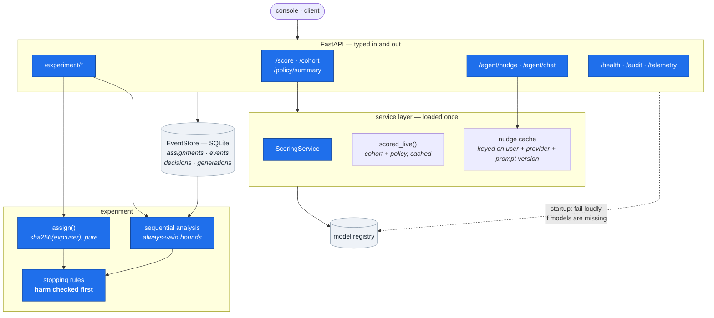
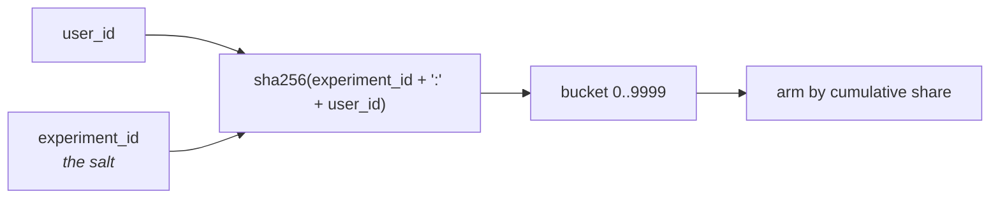
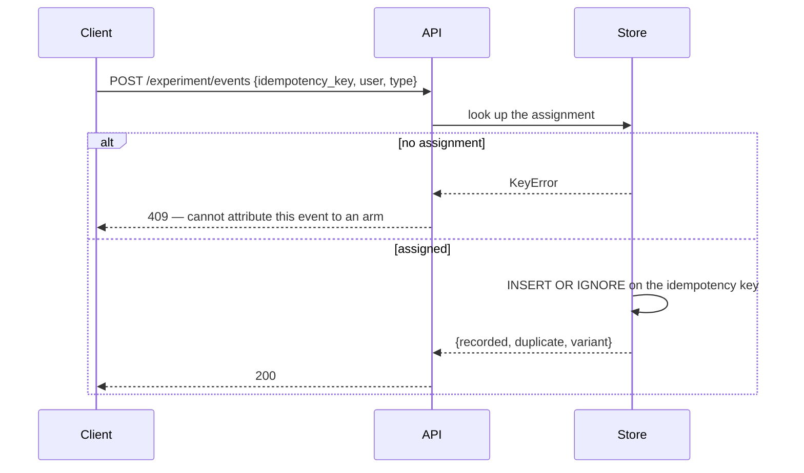
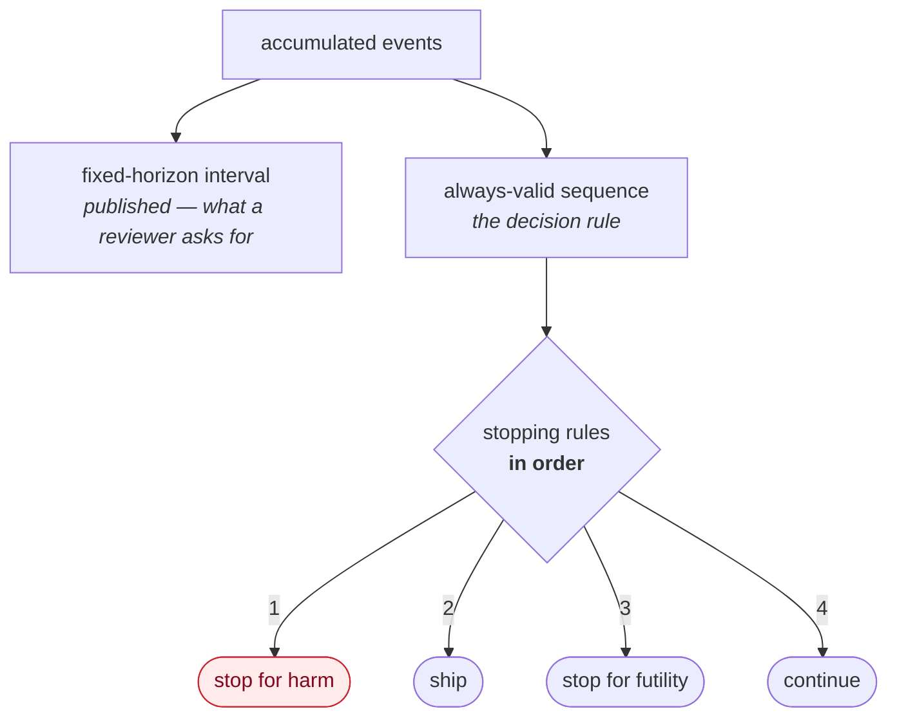

# HLD 007 — Serving API & Experimentation Platform

**Domain**: D · **Spec**: [007](../../../specs/007-serving-api-experimentation/spec.md) · **Status**: Implemented

## Responsibility

Expose the models and the agent over HTTP, assign users to arms in a way that cannot drift,
capture the funnel without double-counting, and analyse the result so it stays valid when
someone reads it every day.

## Component decomposition

## Assignment is a pure function

Nothing is read to decide an assignment, so it is identical on every request, in every process,
after any restart, and whether or not the store was reachable. An assignment that can drift
invalidates the experiment silently.

The experiment id as salt means successive experiments partition independently. Without it, a
user unlucky in one test is unlucky in all of them — correlated assignment nobody notices until
results stop reproducing.

## Event capture

Both behaviours protect the analysis. At-least-once delivery is normal, so a double-counted
conversion is an invented result; and accepting an event from an unassigned user would bias
whichever arm it was guessed into.

Events carry the variant recorded **at assignment**, so the event side of the analysis never
needs to join back — which is also what made the fast `counts()` possible.

## Analysis: two intervals, one decision rule

Harm is checked **first**. Checking success first would let a conversion win mask a retention
breach for as long as the win held — exactly the failure the guardrail exists to catch.

## Interface contracts

| Endpoint | Guarantee |
|---|---|
| `GET /score/{id}` | Full decision with the binding constraint and the value-fit figures; 404, never a default score |
| `GET /cohort` | Paginated, filterable, with the policy summary attached |
| `POST /agent/nudge/{id}` | Cached by user + provider + **prompt version**, so a policy change invalidates every cached message |
| `POST /experiment/events` | Idempotent; 409 for an unassigned user |
| `GET /experiment/summary` | Both intervals, the guardrail against its margin, and a verdict with its governing rule |
| `GET /audit/{id}` | Every decision, generation, assignment and event for one user |
| `GET /health` | Per-subsystem, including the LLM provider's **egress** statement |

## Failure modes

| Failure | Response |
|---|---|
| Model artifacts missing | Startup fails, naming the command that builds them |
| LLM provider unavailable | Nudge degrades and returns 200 marked `degraded` — a model outage is not a product outage for this surface |
| Duplicate event | Counted once, reported as `duplicate` |
| Event for an unassigned user | 409 |
| Unknown user | 404 |
| Concurrent identical nudge requests | Served from cache after the first |

## A performance defect worth recording

The first `counts()` joined `assignments` to `events` with `COUNT(DISTINCT CASE WHEN …)`. At
45,000 assignments against 59,000 events it did not return within ten minutes, because it built
the full arm × event cross product before aggregating.

Rewritten as two indexed aggregations combined in Python: **125 ms**. A dashboard query has to
be fast enough to read casually — which is the entire premise of the always-valid analysis it
feeds.
