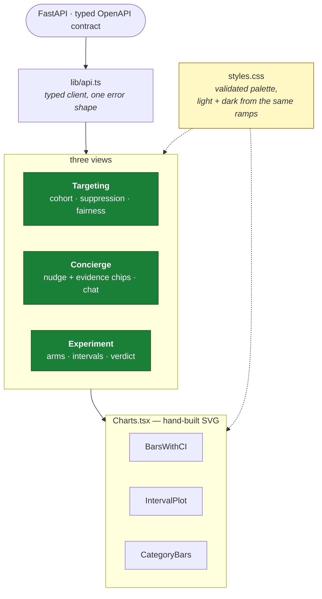
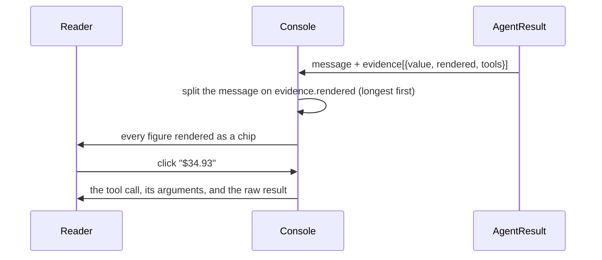

# HLD 008 — Web Console

**Domain**: D · **Spec**: [008](../../../specs/008-web-console/spec.md) · **Status**: Implemented

## Responsibility

Make the system's claims inspectable. The hardest thing to convey about this project is that
the safety properties are *real*; a paragraph asserting "every number is verified" is
unconvincing, and a chip you click to see the tool call is not.

## Component decomposition

## The evidence chip is the product

Longest-first matching stops a short figure consuming an overlapping longer one. A figure whose
provenance list is **empty** renders in the error style, so an ungrounded number is visible
rather than silently plausible.

## Design decisions

**Three categorical series, never four.** The validated palette's fourth slot puts yellow beside
orange, which fails the all-pairs colour-vision floors. The cap is enforced in `Charts.tsx`
rather than left to a caller.

**Aqua carries direct labels.** On the light surface it sits at 2.74:1, below the 3:1 bar, so
the relief rule applies: every series using it is also directly labelled. Identity is never
colour alone.

**Dark mode is selected, not inverted.** The dark steps come from the same ramps, validated
against the dark surface, and are declared under both the OS media query and an explicit theme
stamp so a viewer's toggle wins either way.

**No chart library.** The palette rules and the series cap are enforced in code rather than
configured, every mark carries a tooltip and direct labels without fighting a default theme, and
the bundle stays at 54.7 KB gzipped against a 500 KB budget.

## States are explicit

| State | Treatment |
|---|---|
| Loading | Spinner naming what is loading; for local generation, saying it is real inference |
| Empty | A sentence and the command that produces data — never an empty chart that reads as zero |
| Error | The message, plus the likely cause (is the API running? are models trained?) |
| Degraded | A banner naming the reason and explaining that this is the designed failure path |
| Cached / forced evidence | Badged, so the reader knows what they are looking at |

## Failure modes

| Failure | Response |
|---|---|
| API down | Error state naming the probable cause |
| Nudge still generating | Honest progress state, not a bare spinner |
| Zero events | Explanatory empty state with the seed command |
| Figure with no provenance | Rendered in the error style |
| Long message | Scrolls without breaking chips; the evidence popover is height-capped so guardrail badges stay in view |

## Two defects that only rendering could catch

A typecheck cannot see layout. Both of these came from screenshotting the built app:

1. **viewBox scaling.** Charts are authored in a 560-unit box; letting that scale to a 1200 px
   card multiplied every font size by ~2.2 and left plots swimming in whitespace. Fixed by
   capping the drawing width near its authored size.
2. **Label anchoring.** The de-collision helper computed spaced label positions and then
   anchored the text at each series' original `y`, silently discarding the spacing. The code
   looked correct and the labels still overlapped.
