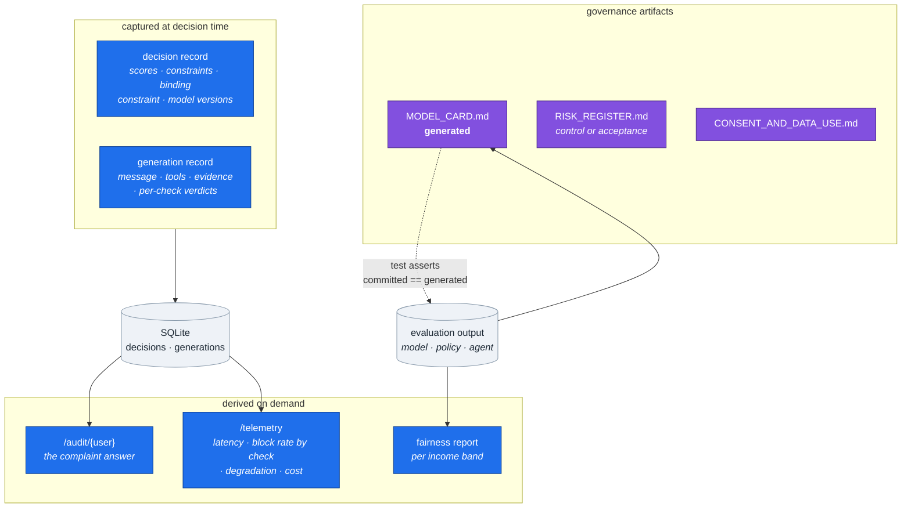
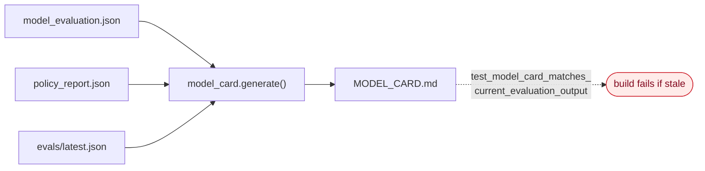

# HLD 009 — Observability, Cost Control & AI Governance

**Domain**: E · **Spec**: [009](../../../specs/009-observability-governance/spec.md) · **Status**: Implemented

## Responsibility

Answer two questions that decide whether a system like this ships in a regulated environment,
and neither is about model quality:

1. *"A customer says they were pushed into a subscription. Show me exactly why your system
   contacted them."*
2. *"Show me this does not systematically treat lower-income users differently."*

Both need artifacts that exist **before** the incident. A decision log written afterwards is not
evidence.

## Component decomposition



## The model card is generated

A hand-maintained model card is a document that was true once. It drifts the moment someone
retrains, and nobody notices because nothing checks it.



A stale card is a failing test rather than a discovery during review.

## Fairness reporting that is not theatre

```text
contact_rate(band)   what the policy did
eligible_rate(band)  a property of the population
policy_induced_gap   the part we are answerable for
```

Reporting only the contact-rate gap conflates a gap we inherited with one we created. Bands
below a minimum count are reported and **marked low-confidence** rather than dropped — dropping
them hides exactly the small groups a fairness review exists to protect.

## Telemetry signals that matter

| Signal | Why it is the one to watch |
|---|---|
| `guardrail_block_rate` by check | Rises days before output quality visibly degrades; > 0.15 is treated as a prompt regression |
| `degradation_rate` + reasons | Distinguishes a model problem from an infrastructure one |
| `forced_evidence_rate` | How often the model declined to look — under-investigation as a number |
| `repair_attempts` | Tool-call reliability as a measurement rather than a vibe |
| latency p50/p90/p99 by provider | Whether the quality tier earns its cost |

## Interface contracts

| Contract | Guarantee |
|---|---|
| `GET /audit/{user_id}` | Every assignment, decision, generation and event for that user |
| `GET /telemetry` | Aggregates with a block-rate flag |
| `model_card.generate()` | Deterministic given the artifacts; raises naming the command when they are absent |
| Risk register | Every risk names a control with a test, or an explicit acceptance |

## Failure modes

| Failure | Response |
|---|---|
| Artifacts missing when generating the card | Raises, naming the pipeline command |
| Committed card drifts from the metrics | Test fails |
| Risk with neither control nor acceptance | Test fails — this caught a real gap (out-of-scope advice) |
| Band too small for a stable rate | Reported with its count and marked low-confidence |
| Telemetry gap | Visible in the series, never interpolated |
