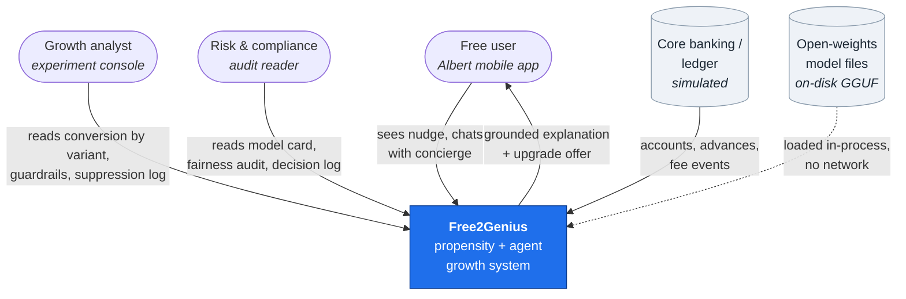
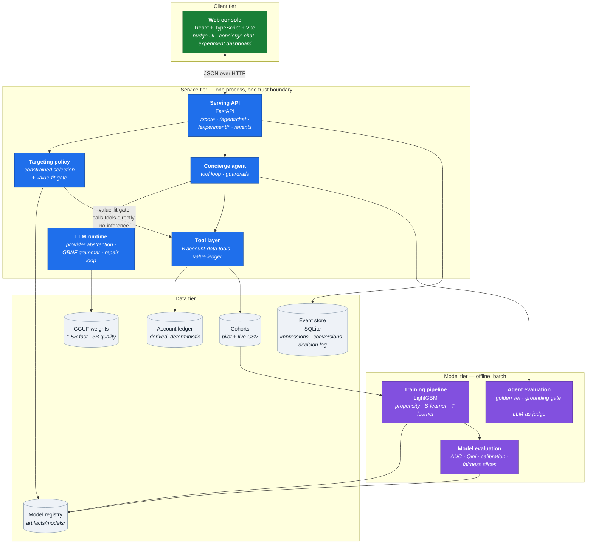
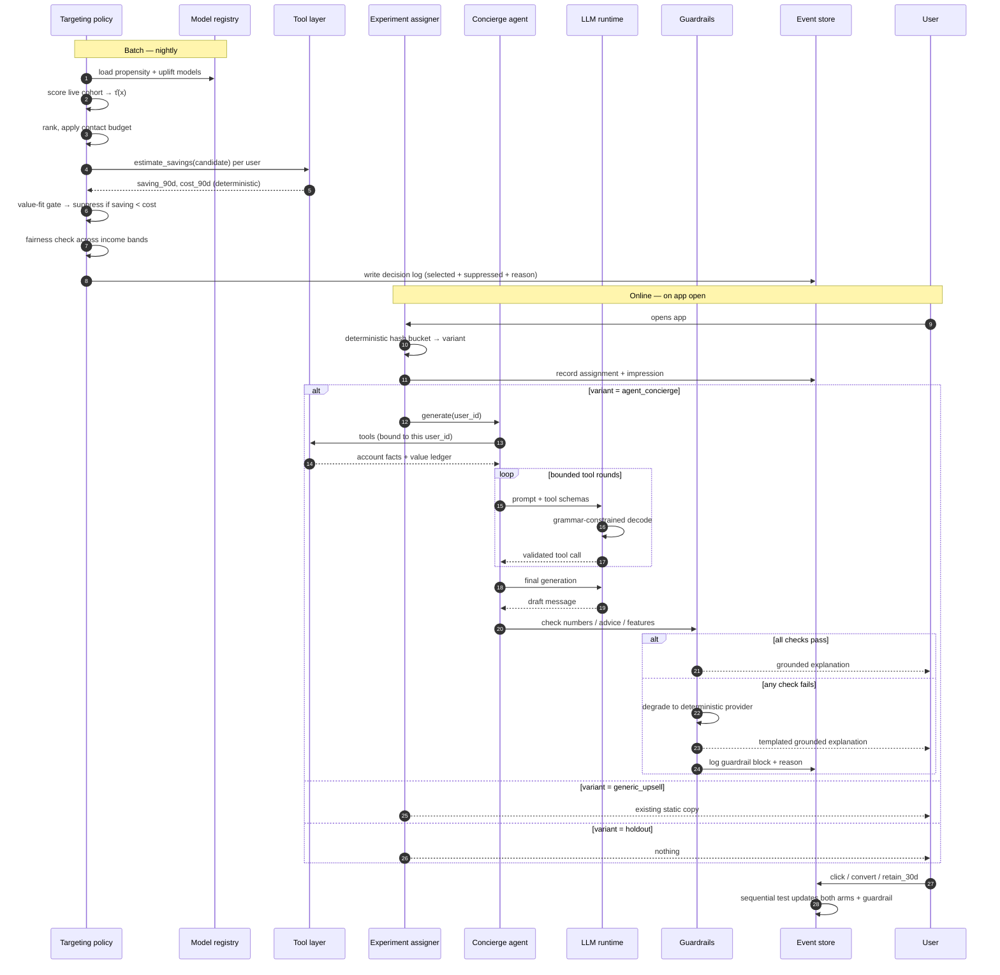
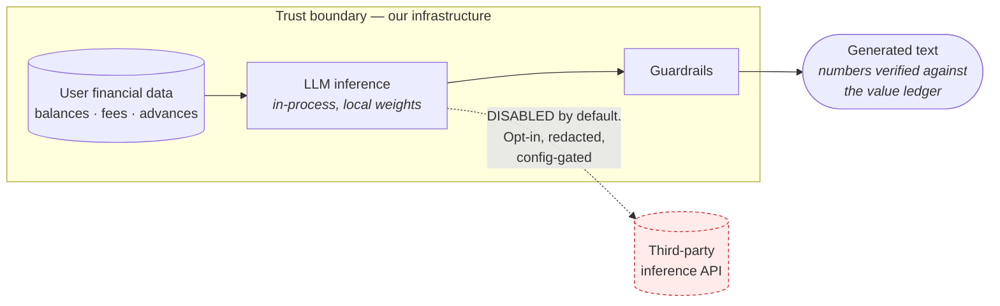
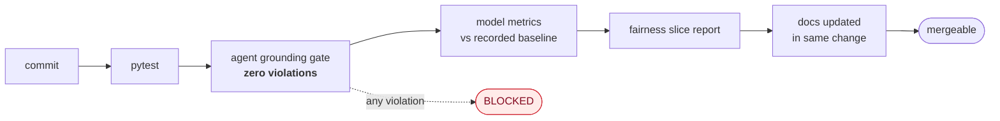

# Free2Genius — System Architecture (HLD Level 0)

> **Synthetic data notice.** Every user, transaction, fee and price in this system is
> generated by `f2g/data/`. No Albert data, customer data, or production model is used.
> Pricing is an illustrative placeholder.

## 1. What the system does

Free2Genius decides **who** among free users to invite to the paid Genius tier, and
**what to say** to each of them, then measures whether it worked without letting the
measurement be gamed.

Three decisions, three owners:

| Decision | Owner | Signal |
|---|---|---|
| Who is *movable*? | Uplift model | Estimated treatment effect τ̂(x) from a randomized pilot |
| Who *should* be moved? | Targeting policy | τ̂ subject to budget, fairness, retention and value-fit constraints |
| What do we say? | Concierge agent | The user's own fee history, narrated by a local LLM under hard guardrails |

## 2. Context view (C4 Level 1)

The dotted edge matters: model weights are read from local disk into the serving process.
There is no inference vendor in this diagram. See
[ADR-001](../adr/ADR-001-local-first-inference.md).

## 3. Container view (C4 Level 2)

### Why the policy has an edge to the tool layer

`policy → tools` is the [ADR-004](../adr/ADR-004-value-fit-gate.md) coupling. The
targeting policy needs each candidate's grounded savings estimate to apply the value-fit
gate, and it gets it by calling the **deterministic tool layer** — not the agent. No model
inference is required to decide eligibility, so the gate is cheap, reproducible, and runs
over the whole live cohort in batch.

## 4. The decision pipeline end to end

## 5. Trust boundary

Two properties hold in the default configuration, and both are testable:

1. **No egress.** No user attribute reaches a third-party inference provider.
2. **No unverified number.** Nothing crosses the boundary outward unless every numeric
   token in it appears in the session's value ledger
   ([ADR-007](../adr/ADR-007-numeric-grounding-ledger.md)).

## 6. Quality gates in the pipeline

The grounding gate is absolute. It runs locally at zero marginal inference cost, which is
the reason it can be absolute rather than sampled — see
[ADR-001](../adr/ADR-001-local-first-inference.md) consequences.

## 7. Per-feature architecture documents

| Feature | HLD | LLD |
|---|---|---|
| 001 Synthetic data foundation | [hld/001](hld/001-synthetic-data-foundation.md) | [lld/001](lld/001-synthetic-data-foundation.md) |
| 002 Propensity & uplift models | [hld/002](hld/002-propensity-uplift-models.md) | [lld/002](lld/002-propensity-uplift-models.md) |
| 003 Targeting policy engine | [hld/003](hld/003-targeting-policy-engine.md) | [lld/003](lld/003-targeting-policy-engine.md) |
| 004 Local LLM runtime | [hld/004](hld/004-local-llm-runtime.md) | [lld/004](lld/004-local-llm-runtime.md) |
| 005 Concierge agent & guardrails | [hld/005](hld/005-concierge-agent-guardrails.md) | [lld/005](lld/005-concierge-agent-guardrails.md) |
| 006 Agent evaluation harness | [hld/006](hld/006-agent-evaluation-harness.md) | [lld/006](lld/006-agent-evaluation-harness.md) |
| 007 Serving API & experimentation | [hld/007](hld/007-serving-api-experimentation.md) | [lld/007](lld/007-serving-api-experimentation.md) |
| 008 Web console | [hld/008](hld/008-web-console.md) | [lld/008](lld/008-web-console.md) |
| 009 Observability & governance | [hld/009](hld/009-observability-governance.md) | [lld/009](lld/009-observability-governance.md) |
