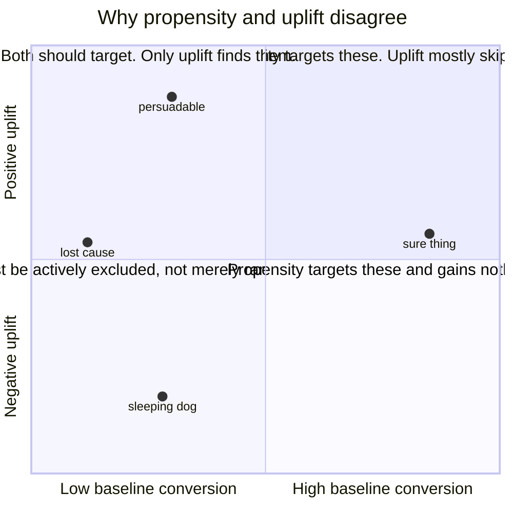
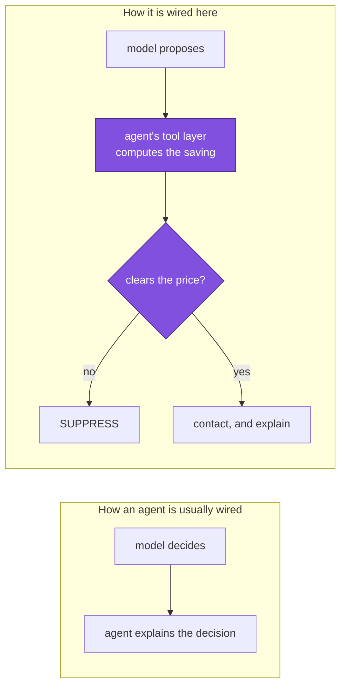

# Part 1 — Why this exists

**Written for: you, learning the project.** Previous: [index](README.md) · Next: [architecture](02-architecture.md)

---

## 1.1 The business problem

A consumer fintech app has a free tier and a paid tier called **Genius**. Genius
removes fees the free tier charges — expedited cash-advance delivery, and overdrafts
it can prevent — and adds budgeting and savings tools.

Most free users never upgrade. Not because the product is bad for them, but because
they never see what it would do for *them specifically*. The existing intervention is
a generic upsell banner, which users correctly ignore because it says nothing about
their situation.

Two things have to be true for an upgrade to make sense:

1. The user has to be **movable** — a message has to be capable of changing their mind.
2. The user has to **actually benefit** — the subscription has to save them more than
   it costs.

Those are different questions, and almost every growth system answers only the first,
badly.

---

## 1.2 The obvious solution, and why it is wrong

The brief a growth team usually writes is: *"build a model that predicts who will
subscribe, and target the top decile."*

That is a **propensity model**: `P(convert)`. It is easy to train, easy to explain,
and scores a high AUC. Here it reaches **ROC AUC 0.8598**.

It is also the wrong thing to build, for two independent reasons.

### Reason one: it buys conversions you already had

`P(convert)` is dominated by users who were going to convert anyway. Rank by it and
you spend the contact budget on people who needed no contact, then report their
conversions as programme impact.

This is measurable here, because the simulation knows each user's latent type. At a
10% contact budget:

| segment | uplift ranking selects | propensity ranking selects |
|---|---|---|
| `persuadable` — movable | **76.7%** | 3.3% |
| `sure_thing` — converting anyway | 22.5% | **96.7%** |
| `sleeping_dog` — harmed by contact | 0.7% | 0.0% |

*Source: `artifacts/reports/model_evaluation.md`, "Where propensity ranking spends its budget".*

Propensity targeting puts **96.7%** of its budget into users who were already
converting. It is not wrong about who will convert. It is answering a question nobody
should have asked.

### Reason two: it cannot say "do not contact"

Some users respond *negatively* to being marketed at. In this population they are the
fee-stressed, high-support-contact segment, and their true uplift is **−2.2 pp** — a
nudge makes them measurably less likely to subscribe.

A propensity model has no vocabulary for this. It can say "less likely to convert". It
cannot say "contacting this person makes things worse". Those are different statements
and only the second one lets you decline.

---

## 1.3 What to build instead: uplift

The right target is the **conditional average treatment effect**:

```text
τ(x) = P(convert | features x, contacted) − P(convert | features x, not contacted)
```

Read it as: *for a user who looks like this, how much does contacting them change the
outcome?* It can be positive, near zero, or negative.

### Why you cannot just measure it

For any individual user you observe **one** arm. They were contacted or they were not.
The difference is never observed for anybody. This is the fundamental problem of causal
inference, and it has three consequences that shape the whole codebase:

1. **You need randomised historical data.** If contact was assigned by some existing
   rule, the treated and untreated groups differ in ways you cannot see, and any
   difference you measure mixes the effect with the selection. Here, the pilot cohort
   was randomised 50/50, which is what makes τ identifiable at all.
2. **You cannot score the model with AUC.** AUC needs a label per row. τ has no label.
   Part 3 covers what replaces it.
3. **You cannot validate it on real data.** You never learn the right answer. This is
   exactly why the project generates a synthetic population — see 1.5.

### The four latent segments

The simulated population contains four hidden archetypes. They are never model inputs;
they only shape observable behaviour, so the learner has to recover the effect from
signals a real product would actually log.

| segment | share | baseline conversion | true uplift | what they are |
|---|---|---|---|---|
| `persuadable` | 24% | low-ish | **+6.54 pp** | Pays real fees, engaged enough to act. The nudge teaches them something true. |
| `sure_thing` | 16% | high | +0.71 pp | Converting anyway. Contact adds almost nothing. |
| `lost_cause` | 44% | very low | +0.16 pp | Dormant. Nothing moves them. |
| `sleeping_dog` | 16% | low | **−2.19 pp** | Fee-stressed, already in support. Contact irritates. |

*Source: `python run.py data`.*



The two rankings agree in the corners nobody cares about and disagree exactly where
the money is.

---

## 1.4 The metric design

This is where most growth projects quietly go wrong, and it is worth being slow here.

### Goal metric

**Free-to-Genius conversion rate.** Fine on its own terms, and trivially gameable: you
can raise it by persuading anyone, including people the product will not help.

### Guardrail metric

**30-day retention among converters**, with a non-inferiority margin of **3 percentage
points**.

The constitution for this project states the rule as: *every goal metric ships with a
counter-metric that detects the cheapest way to game it.* A conversion you refund, or
that churns in a month, is not revenue.

### Why the guardrail has teeth here

This is a design detail worth understanding, because it is what makes the guardrail
more than decoration.

In the data generator, retention after conversion depends on **value fit** — how much
the subscription would genuinely save that user — *interacted with whether the nudge
caused the conversion*:

```python
retain_p = 0.58 + 0.34 * value_fit - 0.22 * pushed * (1 - value_fit)
```

Read the third term carefully. Being *pushed* over the line only hurts retention when
value fit is **poor**. A nudged user who genuinely benefits retains normally.

So a policy that maximises conversion by persuading poor-fit users will show up as a
retention loss, automatically. The counter-metric is not a separate initiative bolted
on; it is a mechanical consequence of the thing you did wrong.

*Source: `f2g/data/generate.py`, `generate_cohort`.*

---

## 1.5 Why the data is synthetic, and why that is a strength

Synthetic data is usually a weakness in a portfolio project — it lets you prove
whatever you like. Here it is deliberately the opposite, for one reason:

**Because the data-generating process is known, every user's true τ is known.**

That buys three things no real dataset can offer:

1. **The uplift estimator can be validated directly.** Correlate predicted τ̂ against
   true τ. Measured Spearman: **0.633**. On real data this correlation is
   unobservable, so you are forced to trust proxy metrics.
2. **An oracle ceiling exists.** Rank users by their *true* τ and you get Qini 1.2815 —
   the best any model could do on this population. The production model's 0.7822 is
   therefore **61% of achievable**, which is a far more meaningful statement than an
   absolute number with no scale.
3. **Off-policy estimators can themselves be checked.** Part 3 estimates what a
   candidate policy would have achieved without running it. You can then compare that
   estimate to the truth. The doubly-robust interval covers the true value for all
   five candidate policies — that validates the *estimator*, not just the policy.

The honesty requirement that comes with this: every generated report, the model card,
the API description, every console view and every chart caption states the data is
synthetic. Overstating provenance is treated in this project as a defect of the same
severity as a broken guardrail.

---

## 1.6 The idea that makes this project distinctive

Everything above is good practice. This next part is the thing that is unusual.

Uplift targeting answers *"who is most movable"*. It does not answer *"who should be
moved"*, and those come apart uncomfortably: **the most movable users include people
who can be talked into a subscription that will save them nothing.**

Contacting them is optimal under the conversion metric and indefensible under any
other reading. It also shows up later as churn — which the retention guardrail detects,
*after* those people have been charged.

A guardrail that catches harm after it happens is worth having. A constraint that
prevents it is worth more.

### The value-fit gate

For every user the policy would otherwise contact, the system computes — in Python,
deterministically, from that user's own 90-day fee history — the estimated saving and
the subscription cost over the same window. If

```text
estimated_saving_90d  <  genius_cost_90d × margin        (margin defaults to 1.0)
```

the user is **suppressed regardless of predicted uplift**.



This inverts the usual dependency. The agent is normally a downstream consumer of the
model's decision. Here its grounded arithmetic is an **upstream veto** over that
decision.

### What it does in practice

*Source: `python run.py policy`.*

| | |
|---|---|
| Candidates | 12,000 |
| Selected for contact | 1,801 |
| **Binding constraint** | **`value_fit`**, not budget |
| Suppressed by value fit | 7,530 |
| Suppressed for non-positive uplift | 2,669 |
| Mean estimated saving of contacted users, gate **on** | **$70.21** |
| Same, gate **off** | **$34.75** |
| Users the gate alone removed | 1,604 |
| Expected conversions forgone | 95.3 |

Two things to notice.

**The gate binds before the budget does.** The budget permits 2,400 contacts; the
system sends 1,801. It did not run out of budget, it ran out of users it could honestly
contact.

**The cost is reported.** 1,604 users and 95.3 expected conversions, given up. That is
a real trade and the report states it in both directions. A trade reported only in the
direction that flatters the system is advocacy, not analysis.

### Why this is structurally different from a policy or a principle

A feature can be traded off against other features. A constraint cannot. The gate runs
*before* the contact budget, so it cannot be masked by the budget having already
excluded someone — which also means the suppression log records the true reason.

The sentence to be able to say out loud:

> This system structurally cannot hit its conversion target by mis-selling, because the
> honesty check sits inside the targeting decision rather than beside it.

---

## 1.7 Check your understanding

Answer these before moving on. Answers are in the text above.

1. A colleague says "our propensity model has AUC 0.86, that is clearly good enough for
   targeting." What is wrong with the inference, in one sentence?
2. Why can you not compute AUC for the uplift model?
3. What single property of the synthetic data makes it a strength rather than a
   weakness here?
4. The retention guardrail could have been a simple "did they stay 30 days" flag. What
   does the `pushed × (1 − value_fit)` interaction add?
5. The value-fit gate costs 95.3 expected conversions. Argue the other side: why is
   that not simply money left on the table?

> On question 5, the answer the project gives is in the retention chart — the arm that
> only contacts users who benefit retains **6.3 points better**. Part 5 covers it.

---

Next: [Part 2 — System architecture](02-architecture.md)
