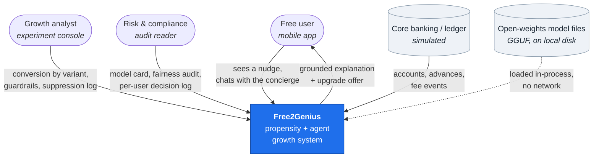
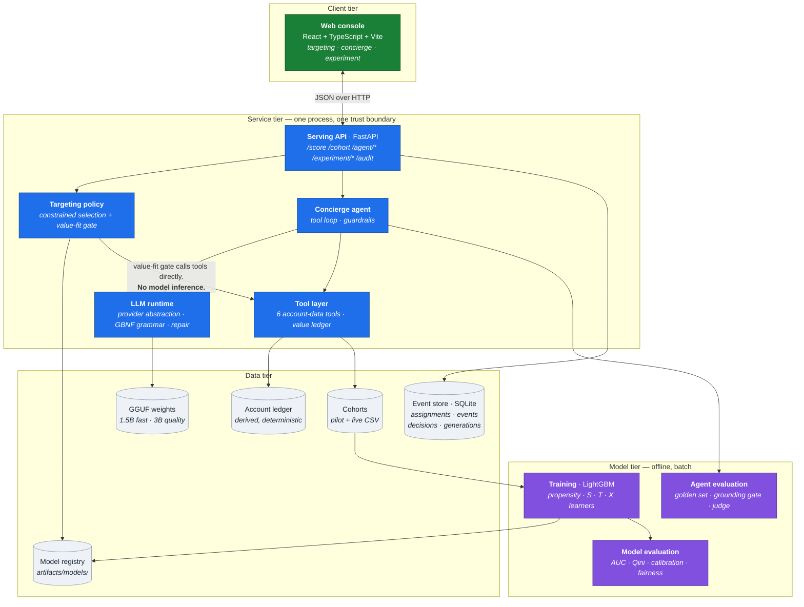
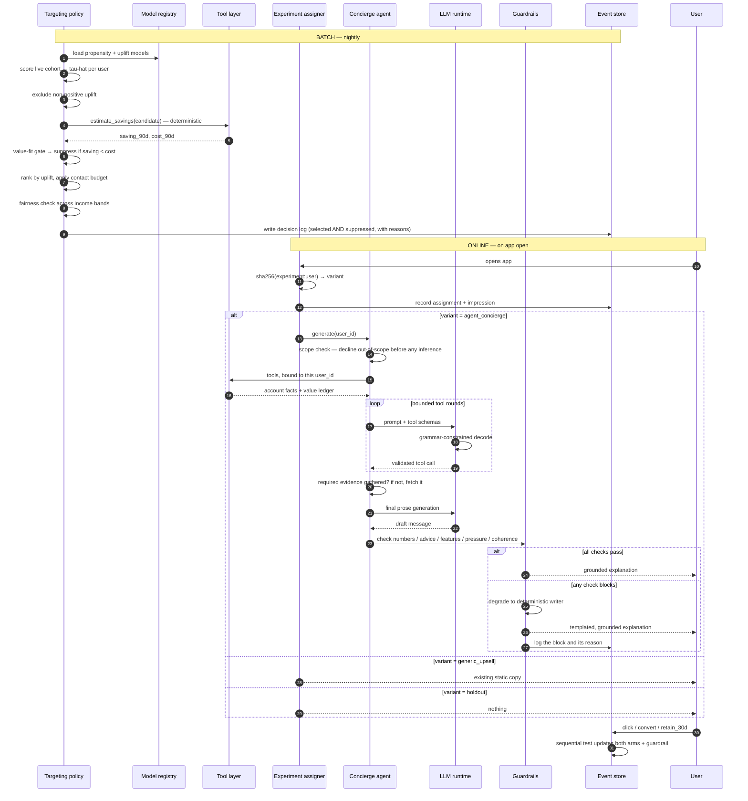
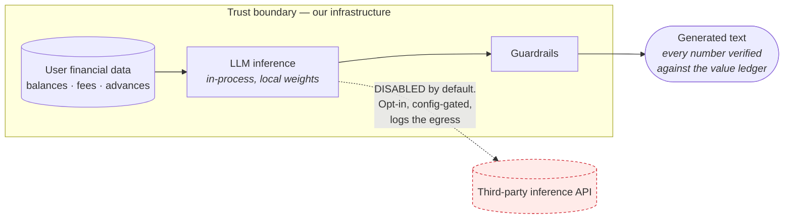
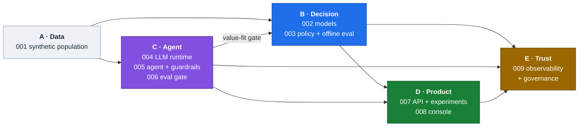
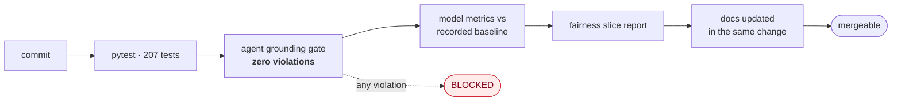

# Part 2 — System architecture (HLD)

**Written for: you, learning the project.** Previous: [why this exists](01-why-this-exists.md) · Next: [decision layer](03-decision-layer.md)

This is the high-level design: what the pieces are, how they connect, and one request
traced all the way through. Part 3 onwards goes inside each piece.

---

## 2.1 Context — who touches the system

Notice what is **absent**: there is no inference vendor in this diagram. Model weights
are read from local disk into the serving process. That is a deliberate decision and
part 4 explains what it buys.

---

## 2.2 Containers — the five tiers

### The one edge worth staring at

`policy → tools` is the value-fit gate from part 1, and it is the architectural
signature of this project.

The policy needs each candidate's grounded savings estimate. It gets it by calling the
**deterministic tool layer**, not the agent. Three consequences:

1. **No inference is needed to decide eligibility**, so the gate runs over 12,000 users
   in seconds and is exactly reproducible.
2. **The number that decides eligibility is the same number the user is later shown.**
   The decision and the explanation cannot disagree.
3. It works with no model weights present at all.

---

## 2.3 The decision pipeline, end to end

This is the spine of the system. If you can narrate this diagram, you can explain the
project.

### Five things to notice in that trace

1. **The gate runs before the budget** (steps 6–8). If the budget ran first, a user
   could be excluded for ranking poorly and the gate would never evaluate them — the
   log would say `budget` where the truth is `value_fit`.
2. **Suppressed users are logged too.** "Why was I not contacted?" has a factual answer.
3. **Scope is checked before any inference.** A refusal that depends on the model
   cooperating is not a control.
4. **A guardrail block is not an error.** The user still receives a correct, grounded
   message; we get a logged reason.
5. **Three arms, not two.** The holdout separates "the agent helped" from "any nudge
   helped".

---

## 2.4 Trust boundary

Two properties hold in the default configuration, and both are testable:

| property | how it is enforced |
|---|---|
| **No egress** — no user attribute reaches a third-party inference provider | default provider is in-process; a test asserts the agent imports no concrete provider |
| **No unverified number** — nothing leaves unless every numeric token is accounted for | value-ledger set membership, checked before output |

---

## 2.5 How the layers depend on each other

The edge that runs *backwards* — `Agent → Decision` — is the value-fit gate. Every
other dependency flows the way you would expect.

---

## 2.6 Quality gates in CI

The grounding gate is **absolute** — one violation fails the build, it is not a
regression to triage later. That is only affordable because local inference costs
nothing per run, so the gate covers *every* case on *every* commit rather than a
sample. A sampled safety gate is not a gate.

---

## 2.7 Where the code lives

| Layer | Package | Entry point |
|---|---|---|
| Data | `f2g/data/` | `python -m f2g.data.generate` |
| Models | `f2g/ml/` | `python -m f2g.ml.train` |
| Policy | `f2g/ml/policy.py`, `ope.py` | `python -m f2g.ml.run_policy` |
| LLM runtime | `f2g/llm/` | library |
| Agent | `f2g/agent/` | library |
| Agent evaluation | `f2g/evals/` | `python -m f2g.evals.run` |
| API + experiment | `f2g/api/`, `f2g/experiment/` | `uvicorn f2g.api.main:app` |
| Console | `web/src/` | `npm run dev` |
| Governance | `f2g/governance/` | `python -m f2g.governance.model_card` |

---

## 2.8 Check your understanding

1. Trace what happens between a user opening the app and seeing a nudge. Which steps
   involve a language model, and which do not?
2. Why does the value-fit gate call the tool layer instead of the agent?
3. The policy applies four constraints. Name them in order and explain why value fit
   comes before budget.
4. What breaks if variant assignment is not a pure function of `(user_id, experiment_id)`?
5. Why can the grounding gate be absolute here when most teams would have to sample?

---

Next: [Part 3 — Decision layer](03-decision-layer.md)
