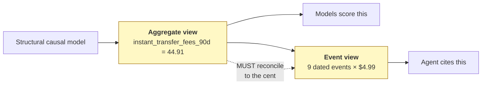
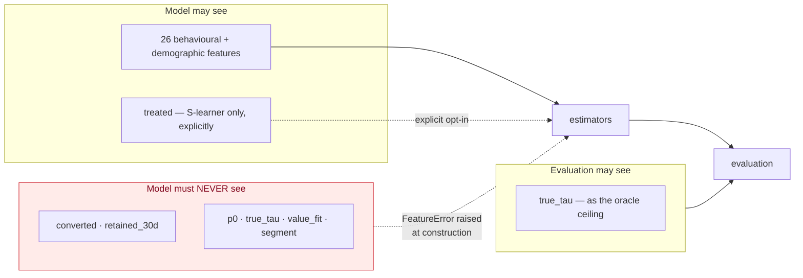
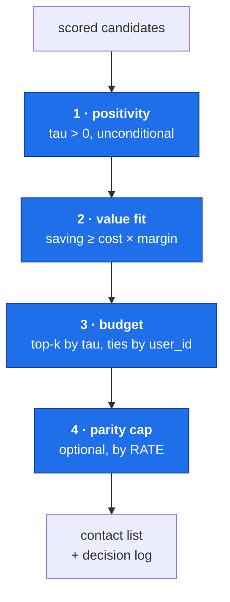

# Part 3 — Decision layer (LLD)

**Written for: you, learning the project.** Previous: [architecture](02-architecture.md) · Next: [agent layer](04-agent-layer.md)

Who gets contacted, and how we know the answer is right. This is the longest part.
Take it in two sittings if you need to: 3.1–3.5 is modelling, 3.6–3.9 is decision-making.

---

## 3.1 The data layer

**Code:** `f2g/data/` — `schema.py`, `generate.py`, `accounts.py`, `catalog.py`
**Run:** `python run.py data`

### What it produces

Two cohorts, mirroring how a real programme is bootstrapped.

| cohort | rows | has outcomes? | used for |
|---|---|---|---|
| `pilot` | 60,000 | yes — randomised 50/50 nudge | training and evaluating models |
| `live` | 12,000 | no | scoring, the policy, the console |

### The structural causal model

`generate.py` is written as an explicit generative chain, not a fitted joint
distribution, so every dependency is inspectable:

```text
segment  ~  Categorical(persuadable .24, sure_thing .16, lost_cause .44, sleeping_dog .16)
X        ~  P(behaviour | segment)               # 26 observable features
p0       =  sigmoid(f(X) + segment_offset + noise)
tau      =  g(X, segment)                        # heterogeneous, clipped to keep p0+tau valid
T        ~  Bernoulli(0.5)                       # randomised — this is what identifies tau
Y        ~  Bernoulli(p0 + tau*T)
R        ~  Bernoulli(h(value_fit, was_pushed))  |  Y = 1
```

**The segment is never a feature.** It shapes observable behaviour only, so the learner
has to recover the effect heterogeneity from signals a real product would log. Expose
it and uplift modelling becomes a lookup, proving nothing.

### The shape of the effect function

This is the part that makes the problem non-trivial:

```python
fee_pain  = clip(instant_transfer_fees/30 + overdraft_fees/120, 0, 3)
reachable = sigmoid(0.18 * app_opens - 1.1) * (1.0 if push_enabled else 0.7)

tau(persuadable) = 0.030 + 0.045 * fee_pain * reachable + 0.020 * direct_deposit
```

`fee_pain × reachable` is a **product**, and that is deliberate. Effect requires both a
*reason to switch* and the *ability to receive the message*. Neither feature alone
predicts it, so a model has to learn an interaction rather than a main effect.

### Verify it yourself

```bash
python run.py data
```

```text
control conv rate: 0.1513
treated conv rate: 0.1666
observed ATE     : +0.0153  (true mean tau +0.0140)

mean true uplift by segment:
                mean   size
lost_cause    0.0016  26454
persuadable   0.0654  14411
sleeping_dog -0.0219   9596
sure_thing    0.0071   9539
```

The observed average treatment effect (+0.0153) tracks the mean of the hidden τ
(+0.0140) within sampling error. If it did not, the simulation would be internally
inconsistent and every downstream metric would be measuring something other than what
it claims. A test asserts this: `tests/test_data_generation.py::test_observed_ate_matches_true_tau`.

### Two views of one user, and why they must agree

The model sees **aggregates**. The agent needs **events** — "three $4.99 fees on 12 Jul,
28 Jul and 14 Aug", not "you pay some fees".



If these diverged, the model would score a user on $44.91 of fees while the agent told
them about $39.92 — same user, two stories, no error anywhere. That class of bug
destroys trust in a system like this.

Reconciliation is enforced **by construction**, not checked afterwards:

| collection | mechanism |
|---|---|
| Fee events | Emitted from the same counts that produced the aggregate. The sum is arithmetically forced. |
| Subscriptions | Merchant prices drawn, then **rescaled** by `target_total / raw_total`. Exact. |

Ledgers are also **derived, not stored** — seeded from `sha256(user_id)`, so any user id
works, nothing needs keeping in sync, and there is no fixture that can drift.

### The leakage boundary



Enforced at pipeline construction, not at review time. Passing `true_tau` as a feature
raises before a single row is read. `tests/test_no_leakage.py` asserts the sets stay
disjoint — the single most important test in the repository, because leakage produces a
spectacular metric and a worthless model.

---

## 3.2 The feature pipeline

**Code:** `f2g/ml/features.py`

One pipeline, shared by training and serving. Training/serving skew — a column added in
a notebook, a category encoded differently at inference — is the most common way a model
that scored well offline behaves badly in production, and the only defence that works is
having one code path both sides call.

Two invariants:

1. **Column order is recorded.** LightGBM consumes positional arrays. Present the same
   columns in a different order and every prediction is quietly wrong with no error. So
   the ordered list is part of the saved model bundle and is checked on load.
2. **No label, treatment or oracle column can enter.** Declared groups, asserted by test.

```python
CATEGORY_LEVELS = {"income_band": INCOME_BANDS, "age_band": AGE_BANDS, ...}
```

Category levels are **declared, not learned from data**, so an unseen level at serving
time becomes `NaN` (which LightGBM handles) instead of shifting every subsequent code
and corrupting the row.

---

## 3.3 The propensity model

**Code:** `f2g/ml/models.py::PropensityModel`

`P(convert | x)`, LightGBM, trained **on the control arm only**.

### Why control arm only

Fitted on the pooled population it would absorb the average treatment effect and become
a blend of "will convert" and "was contacted". Fine for a scoring service, fatal as a
baseline: the comparison in the evaluation would already contain part of the answer.

### Measured

| metric | value |
|---|---|
| ROC AUC | **0.8598** |
| PR AUC | 0.5190 |
| Log loss | 0.3031 |
| Expected calibration error | **0.0100** |

Calibration matters as much as discrimination. A model with excellent AUC whose
predictions are biased 2× high ranks users correctly and makes every expected-value
calculation downstream wrong.

**Its role in this system:** a diagnostic baseline and an explanation feature. It never
decides who is contacted.

---

## 3.4 Uplift estimation

### Why AUC does not work

τ is never observed for any individual. AUC needs a label per row; there is no label.
Reporting AUC against `converted` for an uplift model gives a reassuring number about
the wrong quantity.

What replaces it compares treated and control outcomes **within score strata**.

### Qini, explained properly

Sort users by the score, descending. At each prefix of size *n*:

```text
Qini(n) = Y_t(n) − Y_c(n) × N_t(n) / N_c(n)
```

Where `Y_t`, `Y_c` are cumulative conversions per arm and `N_t`, `N_c` the cumulative
counts.

In words: *conversions among treated users in this prefix, minus what the control users
in the same prefix would have contributed had there been as many of them.* The rescaling
factor makes the arms comparable at every prefix, including early ones where the split is
uneven by chance.

The **coefficient** is the area between that curve and the straight line you would get
from random targeting, normalised. Higher is better; negative means worse than random.

It is **not bounded at 1** — the oracle reaches 1.2815 here, which is exactly why the
oracle is reported as the ceiling rather than assumed to be 1.

### The second metric: realised uplift by decile

Split the score-ordered population into ten buckets and compute the actual
treated-minus-control difference in each. A working estimator shows:

- monotone decline across the top deciles, and
- a **negative bottom decile** — the sleeping dogs it located and will withhold contact from.

That bottom-decile figure is the do-no-harm check, and it is what the policy acts on.

### Three meta-learners, because they fail differently

| estimator | mechanism | characteristic failure |
|---|---|---|
| **S-learner** | one model, treatment as a feature | boosting ignores one weak binary feature among 26; τ̂ collapses toward zero while outcome accuracy stays excellent — invisible if you only look at AUC |
| **T-learner** | one model per arm, τ̂ = difference | variance: two independent fits subtracted, errors compound |
| **X-learner** | regress *imputed* effects, combine by treatment propensity | needs the treatment propensity; more moving parts |

#### How the X-learner works

```text
stage 1   mu1 = P(Y | X, T=1)  fitted on the treated arm
          mu0 = P(Y | X, T=0)  fitted on the control arm

stage 2   treated i :  D_i = Y_i − mu0(X_i)      # observed minus counterfactual
          control i :  D_i = mu1(X_i) − Y_i      # counterfactual minus observed
          tau1 = regress D on X over treated users
          tau0 = regress D on X over control users

combine   tau(x) = g·tau0(x) + (1−g)·tau1(x),   g = P(T=1) = 0.5 (known)
```

Lower variance than a T-learner because stage 2 fits a model **directly to an
effect-shaped target**, which can be regularised toward zero. A T-learner can only
regularise its two halves independently; it has no handle on their difference.

Reference: Künzel, Sekhon, Bickel & Yu (2019), PNAS.

> **Limitation to state out loud:** the X-learner needs the treatment propensity `g`.
> Ours is a known constant because the pilot was randomised. With observational data it
> would itself be a fitted model, and its error would propagate into τ̂.

---

## 3.5 The failure that shaped the model

This is the single most valuable story in the project. Learn it properly.

### What happened

The first uplift estimator was a plain T-learner using the **same hyperparameters as the
outcome model**. It ranked **worse than the propensity baseline it was meant to beat**.

| estimator | Qini | bottom-decile uplift | predicted τ range |
|---|---|---|---|
| T-learner, outcome-tuned | **0.5596** | **+3.07 pp** | [−0.346, +0.377] |
| propensity baseline | 0.6725 | — | — |
| **true τ** | 1.2815 (ceiling) | −5.48 pp | **[−0.044, +0.135]** |

Two failures, one cause. The estimator predicted uplift spanning a range almost **three
times wider than the effect that exists**, and its bottom decile was *positive* when a
working estimator must be negative there. Inspecting that decile confirmed it: 39%
`sure_thing`, 18% `persuadable`. Its extremes were noise, not effect.

### Why — and this is the part to understand

The cause is structural, not a tuning slip.

Default LightGBM settings are tuned to fit a **~15% conversion outcome**. A treatment
effect here is **one to eight percentage points** — an order of magnitude smaller. And a
T-learner **subtracts** two such fits, so their errors *compound* rather than cancel.
There is no way to regularise the difference; only its two halves, independently.

### The fix, in two steps

| change | Qini | bottom decile |
|---|---|---|
| baseline (outcome-tuned arms) | 0.5596 | +3.07 pp |
| **+ regularised arms** (leaves 31→8, min-child 60→300, L2 1→20) | 0.7533 | −0.18 pp |
| **+ X-learner** (regresses imputed effects) | **0.7822** | **−2.39 pp** |

Regularisation did most of the work. The X-learner added the rest and — importantly —
made the bottom decile decisively negative, which is what the do-no-harm policy acts on.

Hence three distinct hyperparameter sets in `models.py`:

```text
BASE_PARAMS         leaves 31, min_child 60,  lr 0.045, L2 1    → fitting a ~15% outcome
UPLIFT_ARM_PARAMS   leaves  8, min_child 300, lr 0.030, L2 20   → resolving a 1-8 pp effect
XLEARNER_STAGE2     leaves  8, min_child 400, lr 0.030, L2 30   → regressing imputed effects
```

Stage 2 is regularised hardest because its target is itself an estimate.

### Two things that make this credible rather than an anecdote

1. **The decision was pre-committed.** `ADR-002` had already written "revisit once
   T-learner Qini plateaus" as the trigger for a more sophisticated meta-learner. The
   condition was met by measurement, not preference.
2. **The broken version still runs.** The unregularised T-learner is trained on every
   pipeline run as a **live ablation**, so the claim is recomputed rather than
   remembered. `tests/test_models.py::test_x_learner_is_less_dispersed_than_unregularised_t`
   pins the fix so a hyperparameter change cannot silently reintroduce it.

### Current standings

```bash
python run.py train
```

| estimator | Qini | % of oracle ceiling |
|---|---|---|
| **X-learner** (production) | **0.7822** | 61% |
| T-learner (regularised) | 0.7533 | 59% |
| propensity (baseline) | 0.6725 | 52% |
| S-learner | 0.5954 | 46% |
| oracle (ceiling) | 1.2815 | 100% |

Spearman correlation with true τ: **0.6330**.

Note that propensity is a **strong** baseline here (0.6725), because fee burden raises
both conversion likelihood and movability — `corr(p̂, τ) = 0.24`. The comparison is
honest rather than a straw man, which also explains why the uplift advantage is modest
at wide reach and large at narrow reach.

### Which estimator ships is decided by measurement

```python
ranked = sorted([("uplift_x", qini_x), ("uplift_t", qini_t), ("uplift_s", qini_s)],
                key=lambda kv: -kv[1])
production_estimator = ranked[0][0]
```

Hard-coding the estimator would have shipped the T-learner — the one that measured worse
than its own baseline. Selecting by Qini at training time is what let the codebase
correct itself, and it re-litigates the choice whenever data or features change.

---

## 3.6 Choosing the operating point

A single number at one budget hides the shape of the problem.

| budget | uplift (X) | propensity | oracle | random | uplift − propensity |
|---|---|---|---|---|---|
| 5% | +8.66 | +4.03 | +12.46 | +2.25 | **+4.62 pp** |
| 10% | +5.90 | −0.24 | +8.59 | +2.05 | **+6.14 pp** |
| 15% | +4.78 | +3.12 | +7.77 | +2.13 | +1.66 pp |
| **20% ← operating** | +4.43 | +3.33 | +7.87 | +1.98 | **+1.10 pp** |
| 30% | +4.41 | +4.00 | +6.91 | +1.29 | +0.41 pp |
| 50% | +3.16 | +3.41 | +4.15 | +1.27 | **−0.24 pp** |

*Incremental conversions per contact, percentage points.*

The advantage is **largest at small reach and disappears past ~30%**, because a large
budget has to include most of the movable population however it is ordered. Past 50% the
uplift ranking is actually behind.

**The operating budget of 20% came out of this table, not out of a planning meeting.**
The original success criterion named 30%; measurement moved it to 20%, and the sweep
became a required output so the reach-dependence can never again hide behind one number.

At 20%, uplift ranking captures **+32.9%** more incremental conversions than propensity.

> **A reporting bug worth knowing about.** At a 10% budget the propensity ranking's
> uplift is −0.24 pp — essentially zero. Expressing the comparison as a *ratio* against
> that produced a headline of **−2577%**. Comparisons are now reported primarily as
> percentage-point differences, and a ratio is suppressed when its denominator is within
> 0.5 pp of zero. A meaningless number is worse than an absent one.

---

## 3.7 The targeting policy

**Code:** `f2g/ml/policy.py`
**Run:** `python run.py policy`

A score is not a decision. Four constraints sit between τ̂ and "send this user a nudge".



### The ordering is load-bearing

**Positivity first**, because contacting someone whom contact harms is not a budget
question.

**Value fit before budget.** If the budget ran first, a user could be excluded for
ranking poorly and the gate would never evaluate them — the suppression log would show
`budget` where the truthful answer is `value_fit`, and the fairness report would
understate how often the gate binds.

**Parity last**, because it should only trim a selection the other constraints approved.

### Value fit, computed two ways

```text
saving_90d = instant_transfer_fees_90d + overdraft_fees_90d × coverage_rate   # 0.70
cost_90d   = GENIUS_MONTHLY_PRICE × 3                                         # $44.97
passes     ⟺ saving_90d ≥ cost_90d × margin                                   # margin 1.0
```

| | reference path | vectorised path |
|---|---|---|
| Source | `ConciergeTools.estimate_savings`, per user | aggregate feature columns |
| Cost | builds a ledger per user | one pass over a frame |
| Used for | what the agent will say; single-user API calls | batch policy cycles over 12,000 users |

They are **pinned to each other by test** (`test_value_fit_paths_agree`, 60 users,
tolerance $0.011), so the fast path cannot drift from what the agent tells the user.

The estimate is deliberately **conservative** — the overdraft shield's coverage rate is
0.70, not 1.0, and the subscription term is omitted from the fast path entirely. Omitting
it makes the gate *stricter*, never laxer, which is the safe direction for a suppression
decision.

### Missing data fails the gate

```python
df.loc[~has_data & still_selected] = NO_DATA
```

Absence of evidence is not evidence of benefit. A user we cannot assess is suppressed,
not passed by default.

### A spec that was wrong, and the code that was right

The specification originally required the *ungated* selection to be a **strict superset**
of the gated one. A test written from it failed against correct code.

It is wrong, and it should be: suppressing a low-benefit user **frees a budget slot**,
which then goes to the next eligible user down the uplift ranking. The gated set is not a
subset — it is a **better-spent set of the same size**. The count is now reported as
`backfilled_by_gate`, and the spec was corrected with the reason recorded in place.

The invariants that *do* hold: every selected user clears the gate, and no gate-rejected
user is ever contacted.

### Measured

| | |
|---|---|
| Candidates / selected | 12,000 / 1,801 |
| Binding constraint | **`value_fit`** |
| Suppressed: value fit / negative uplift | 7,530 / 2,669 |
| Mean estimated saving of contacted, gate on / off | **$70.21 / $34.75** |
| Mean saving of those the gate removed | $17.25 |
| Conversions forgone to the gate | 95.3 |

---

## 3.8 Fairness, decomposed

Reporting a single contact-rate gap conflates a gap you **inherited** with one you
**created**. That conflation is how fairness reporting becomes theatre.

```text
contact_rate(band)  = contacted(band) / n(band)        # what the policy did
eligible_rate(band) = mean(uplift > 0 | band)          # a property of the population
policy_induced_gap  = contact_rate_gap − eligible_rate_gap × contact_budget
```

Measured:

| band | n | eligible rate | contact rate | mean uplift | mean saving |
|---|---|---|---|---|---|
| `lt_25k` | 2,837 | 0.720 | 0.154 | +1.22 pp | **$30.61** |
| `25_50k` | 4,064 | 0.790 | 0.158 | +1.66 pp | $26.60 |
| `50_75k` | 3,053 | 0.795 | 0.137 | +1.74 pp | $24.40 |
| `75k_plus` | 2,046 | 0.806 | 0.149 | +1.55 pp | $24.11 |

Contact-rate gap **0.021** against a 0.10 tolerance. Eligible-rate gap 0.086.

Read that carefully: the lowest-income band has the **lowest eligible rate** (0.720, a
population property — they are less movable) but the **highest mean estimated saving**
($30.61 — they pay the most fees). The policy's contact rate for them, 0.154, is
mid-pack. The gap the policy *adds* is small.

Per-band model quality is reported too, so unequal **accuracy** is visible and not just
unequal treatment:

| band | propensity AUC | calibration error |
|---|---|---|
| `lt_25k` | 0.8488 | 0.0214 |
| `25_50k` | 0.8690 | 0.0161 |
| `50_75k` | 0.8683 | 0.0148 |
| `75k_plus` | 0.8434 | 0.0242 |

Bands below a minimum count are reported and **marked low-confidence**, never dropped —
dropping them hides exactly the small groups a fairness review exists to protect.

> **A bug worth knowing.** The optional parity cap originally capped per-band contact
> *counts*. With bands of unequal size that equalises the wrong quantity, and it
> measurably **widened** the rate gap it was meant to close — 0.064 against 0.040
> uncapped. It now caps by rate.

---

## 3.9 Offline policy evaluation

**Code:** `f2g/ml/ope.py`

Before spending an experiment cycle, answer: *what would this policy have achieved on
data we already hold?* Each user was observed under one arm only, so this is an
**off-policy** question and needs an estimator, not a spreadsheet.

### Four estimators

| estimator | what it does | trade-off |
|---|---|---|
| **IPS** | reweight observed outcomes by `1/P(action taken)` | unbiased under known propensities, high variance |
| **SNIPS** | self-normalised IPS | slightly biased, much lower variance, cannot produce absurd values |
| **DR** | model-based prediction + IPS correction on the residual | consistent if *either* the outcome model or the propensity model is right. Quote this one. |
| **oracle** | `mean(p0 + tau·pi)` from known ground truth | not an estimator — it reads the answer |

```text
e_i          = P(T_i = 1) = 0.5              # known by randomisation
w_i          = 1{t_i = pi_i} / P(action)     # clipped at 20
IPS   = mean(w · y)
SNIPS = Σ(w·y) / Σ(w)
DR    = mean( mu_pi + w · (y − mu_obs) )
```

`mu0`/`mu1` come from the X-learner's stage-1 arm models, which already exist — no extra
fit.

### The check that only synthetic data permits

The oracle is not there to score the policy. It is there to **validate the estimators**.
If the doubly-robust interval covers the true value, the estimator is working.

Measured: **the DR interval covers the oracle for all five candidate policies** —
uplift + gate, uplift ungated, propensity, contact-everyone, contact-nobody.

No real dataset can give you that check, and it is the strongest single argument that
the offline numbers here mean something.

### Weight clipping is always reported

Importance weights are clipped at 20 so a single user cannot dominate the estimate, and
the **clipped fraction is reported on every run**. An unreported clip silently biases the
result, which is worse than the variance it was meant to fix.

---

## 3.10 Check your understanding

1. Why is the propensity model trained on the control arm only?
2. Explain Qini to someone who knows AUC. Why is the Qini coefficient not bounded at 1 here?
3. The first T-learner predicted τ in [−0.346, +0.377] against a true range of
   [−0.044, +0.135]. Explain the mechanism, not just the symptom.
4. Why does the policy apply value fit *before* the budget?
5. A reviewer says "your fairness gap is only 0.021, that seems too good." What do you
   show them?
6. What does the oracle column add to the off-policy evaluation that a confidence
   interval alone does not?

---

Next: [Part 4 — Agent layer](04-agent-layer.md)
