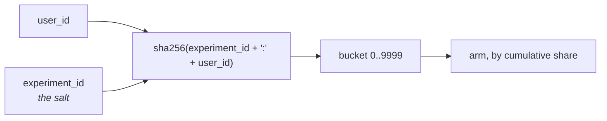
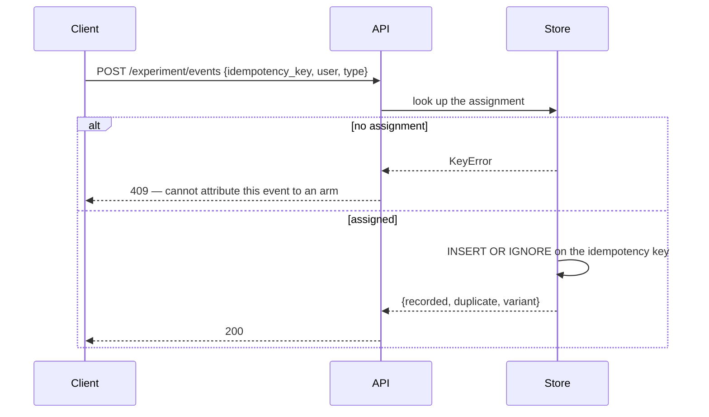
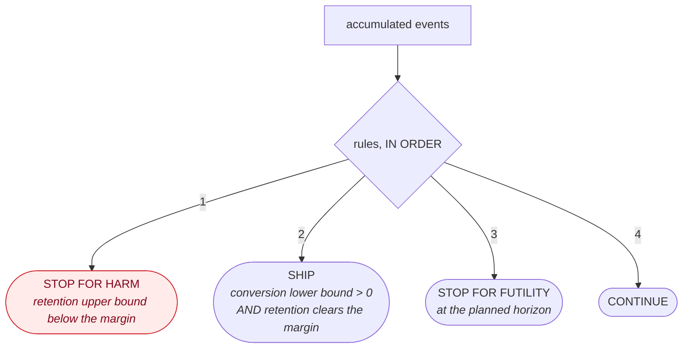
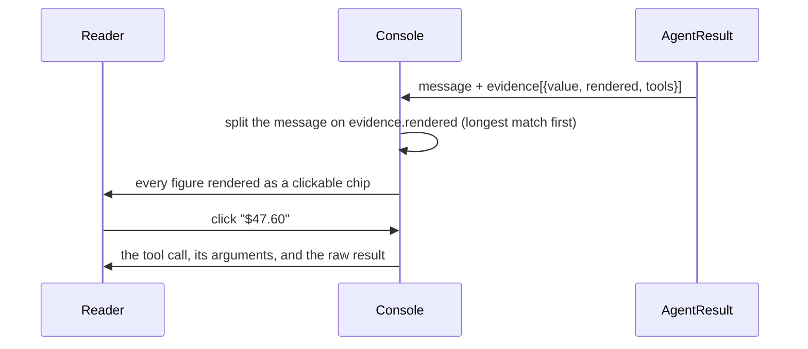
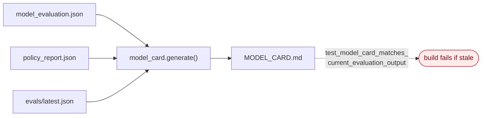

# Part 5 — Product layer (LLD)

**Written for: you, learning the project.** Previous: [agent layer](04-agent-layer.md) · Next: [build journey](06-build-journey.md)

How it reaches a user, how we know it worked, and what survives a compliance review.

---

## 5.1 The serving API

**Code:** `f2g/api/` · **Run:** `python run.py api` → http://127.0.0.1:8000/docs

One FastAPI process. Typed request and response models throughout, so the published
OpenAPI schema is the contract the console is written against rather than a document that
drifts from it.

| endpoint | returns |
|---|---|
| `GET /score/{id}` | propensity, uplift, decision, binding constraint, value-fit figures |
| `GET /cohort` | paginated, filterable cohort with the policy summary attached |
| `POST /agent/nudge/{id}` | message, tool calls, evidence, per-check guardrail verdicts |
| `POST /agent/chat` | the same, conversational |
| `POST /experiment/assign/{id}` | variant, stable |
| `POST /experiment/events` | idempotent funnel capture |
| `GET /experiment/summary` | both intervals, the guardrail, a verdict with its rule |
| `POST /experiment/power` | sample-size calculation |
| `GET /audit/{id}` | every decision, generation, assignment and event for one user |
| `GET /telemetry` | latency percentiles, block rate **by check**, degradation rate |
| `GET /health` | per subsystem, including the LLM provider's **egress statement** |

### Three design choices worth defending

**Startup fails loudly.** If model artifacts are missing, the service refuses to start
and names the command that builds them. A service that starts happily and serves wrong
numbers is worse than one that will not start.

**Unknown user is a 404, never a default score.** Returning a plausible score for a user
that does not exist is how silent data problems become silent decision problems.

**The nudge cache key includes the prompt version.**

```python
key = sha256(f"{user_id}:{provider}:{PROMPT_VERSION}")
```

Local generation takes tens of seconds, so a repeat request must not pay it again. But
including the prompt version means a **policy change invalidates every cached message**
rather than serving stale copy written under old rules.

---

## 5.2 Variant assignment is a pure function

**Code:** `f2g/experiment/assign.py`



Nothing is read to decide an assignment. It is identical on every request, in every
process, after any restart, and whether or not the event store was reachable.

**Why it must be:** a user who sees the treatment on Monday and the control on Tuesday
contaminates both arms, and no analysis can recover from it.

**Why the experiment id is the salt:** without it, every experiment splits users the same
way, so a user unlucky in one test is unlucky in all of them. Correlated assignment across
experiments that nobody notices until results stop reproducing.

### Three arms, not two

| arm | share | what the user gets |
|---|---|---|
| `agent_concierge` | 40% | grounded, per-user explanation from the agent |
| `generic_upsell` | 40% | the existing static copy |
| `holdout` | 20% | eligible, deliberately not contacted |

Two arms would confound *"the agent helped"* with *"any nudge helped"*. The holdout lets
you decompose:

- `agent − holdout` = total programme effect → justifies the **programme**
- `agent − generic` = incremental value of the agent → justifies the **engineering**

The holdout is also the ethical control: if the nudge harms retention, it shows what
would have happened without it.

---

## 5.3 Event capture



Both behaviours protect the analysis:

- **Idempotency.** At-least-once delivery is normal in every real system. A
  double-counted conversion is an invented result.
- **Rejecting unassigned users.** Accepting the event would bias whichever arm it was
  guessed into.

Events carry the variant recorded **at assignment**, so the analysis never needs to join
back — which is also what made the fast summary query possible (see 5.6).

---

## 5.4 Always-valid inference — the statistics that matter

**Code:** `f2g/experiment/analysis.py` · **Decision record:** [`ADR-005`](../adr/ADR-005-sequential-testing.md)

This is a topic you will be asked about. Understand it properly.

### The problem

The textbook design is **fixed-horizon**: compute a sample size, wait, test once at the
end. That design survives contact with a growth team for about a day. Someone opens the
dashboard on day three.

If a decision follows from what they see, the reported p-value is **invalid**. Repeatedly
testing accumulating data inflates the false-positive rate far past the nominal α.

### How far past — measured on this machine

```bash
python -c "from f2g.experiment.analysis import false_positive_simulation as f; print(f(n_looks=200, n_per_look=60, trials=300, seed=1))"
```

| method | false positives, 200 looks, **no true effect**, α = 0.05 |
|---|---|
| naive fixed-horizon test, re-read each time | **0.447** |
| always-valid confidence sequence | **0.023** |

*(Seed-dependent: 0.49 / 0.03 at seed 0. The magnitudes are the point.)*

Nearly **half** of null experiments would be declared winners at a nominal 5%.

### The fix

Report both. The fixed-horizon interval is published — it sets expected duration and is
what a reviewer asks for. The **decision rules use the sequential bound**.

```text
z_fixed(α)  = Φ⁻¹(1 − α/2)                                          = 1.96
z_seq(n, α) = sqrt( (2(nρ² + 1) / nρ²) · ln( sqrt(nρ² + 1) / α ) )    ρ = 0.05
CI          = Δ ± z · se
```

An asymptotic normal-mixture confidence sequence (Howard, Ramdas, McAuliffe & Sekhon,
2021). `z_seq` grows like `sqrt(log n)` — that growth *is* the price of unlimited looks.

**Coverage is verified by simulation, not asserted.** The test
`test_null_experiment_repeated_looks` runs the null experiment and fails the build if the
sequential rate exceeds 0.07 or the naive rate falls below 0.20.

### What it costs

| | |
|---|---|
| Baseline conversion | 15% |
| Minimum detectable effect | +10% relative |
| α = 0.05, power = 0.80 | |
| **n per arm, fixed horizon** | **9,257** |
| **n per arm, sequential** | **11,109** |

About **20% more sample for the same power**. Stated up front, not discovered mid-test.

### The argument in one sentence

> Telling a growth team not to peek is a process control, and process controls fail.
> Making the statistics valid under the behaviour that will actually occur is the more
> robust fix.

---

## 5.5 Stopping rules — harm is checked first

```python
if retention.sequential_ci[1] < -margin:        return STOP_FOR_HARM      # FIRST
if conversion.sequential_ci[0] > 0 \
   and retention.sequential_ci[0] > -margin:    return SHIP               # both, not either
if horizon_reached:                             return STOP_FOR_FUTILITY
return CONTINUE
```



**Order matters and is deliberate.** Checking success first would let a conversion win
mask a retention breach for as long as the win held — exactly the failure the guardrail
exists to catch. `tests/test_experiment.py::test_harm_is_checked_before_success` pins it.

Every verdict carries a `rule` and a `detail`, so the dashboard says *why*, not just
*what*.

---

## 5.6 Reading the current experiment honestly

```bash
python scripts/seed_experiment.py
```

| arm | n | conversion | 30-day retention |
|---|---|---|---|
| `agent_concierge` | 18,030 | **16.27%** | **70.5%** |
| `generic_upsell` | 18,003 | 15.72% | 64.2% |
| `holdout` | 8,967 | 15.32% | 68.1% |

| | |
|---|---|
| Conversion lift (agent − generic) | +0.55 pp (+3.5%), fixed-horizon **p = 0.152** |
| Sequential CI on lift | **[−0.71 pp, +1.81 pp]** — contains zero |
| Retention difference | **+6.31 pp** |
| Sequential CI on retention | **[+2.55 pp, +10.08 pp]** — entirely above zero |
| **Verdict** | **`continue`** |

### Why this is a better demo than a clean win

The conversion effect **has not separated**, and the system says so. It does not reach
for the fixed-horizon p-value, and it does not slice until something clears 0.05.

The guardrail **has** separated, in the agent arm's favour — which is exactly what the
value-fit gate predicts, since that arm only contacts users the gate judged would
genuinely benefit.

The correct read:

> The retention story is real at this sample size, the conversion story is not yet, keep
> running.

That is the answer the design was built to be able to give. A system that refuses to
call an unresolved result is more convincing than one that always finds a win.

### A performance defect worth knowing

The first version of the per-arm summary query joined `assignments` to `events` with
`COUNT(DISTINCT CASE WHEN …)`. At 45,000 assignments against 59,000 events it **did not
return within ten minutes**, because it built the full arm × event cross product before
aggregating.

Rewritten as two indexed aggregations combined in Python: **125 ms**.

A dashboard query has to be fast enough to read casually — which is the entire premise of
the always-valid analysis it feeds.

---

## 5.7 The console

**Code:** `web/src/` · **Run:** `python run.py web` → http://localhost:5173

The hardest thing to convey about this system is that the safety properties are **real**.
A paragraph claiming "every number is verified" is unconvincing. A chip you click to see
the tool call is not.

So the console **renders the machinery, not just the output**.



| element | why it is first-class UI |
|---|---|
| Evidence chips | grounding you can *inspect*, not grounding you are *told about* |
| Per-check guardrail badges | six badges, not one — you see *which* property held |
| Degradation banner | names the reason, explains it is the designed failure path |
| Forced-evidence label | shows when the agent had to fetch what the model skipped |
| Suppression reasons in the cohort table | "why was this user not contacted" answered inline |
| Both intervals overlaid | the sequential bound's extra width is **visible**, not asserted |

A figure whose provenance list is **empty** renders in the error style, so an ungrounded
number is visible rather than silently plausible.

### Design constraints worth mentioning

- **Three categorical series, never four.** The validated palette's fourth slot puts
  yellow beside orange, which fails the colour-vision-deficiency floors. The cap is
  enforced in code, not left to a caller.
- **Dark mode is selected, not inverted** — same ramps, re-stepped for the dark surface,
  validated against it.
- **No chart library.** Palette rules and the series cap are enforced rather than
  configured, every mark carries a tooltip and direct labels, and the bundle stays at
  **54.66 KB gzipped** against a 500 KB budget.

---

## 5.8 Governance

**Code:** `f2g/governance/` · **Docs:** `docs/governance/`

Two questions decide whether a system like this ships in a regulated environment, and
neither is about model quality:

1. *"A customer says they were pushed into a subscription. Show me exactly why your
   system contacted them."*
2. *"Show me this does not systematically treat lower-income users differently."*

Both need artifacts that exist **before** the incident. A decision log written afterwards
is not evidence.

### The audit trail

A record is written **at decision time** for every user — contacted or not — carrying
scores, the constraints evaluated, the binding constraint, the value-fit figures, and the
model and prompt versions. Generations are logged with their tool calls, evidence and
per-check verdicts.

```bash
curl http://127.0.0.1:8000/audit/l0010925
```

Coverage is **100%**, not sampled.

### The model card is generated, not written



A hand-maintained model card is a document that was true once. It drifts the moment
someone retrains, and nobody notices because nothing checks it. Here a stale card is a
**failing test**, not a discovery during review.

### The risk register

14 risks. Every one names either a **control** — a code path with a test that runs in CI
— or an **explicit acceptance**. A mitigation with no control is recorded as accepted
risk, because "we are careful about this" in a register is how controls quietly stop
existing.

A structural test enforces that shape. **It caught a real gap**: the register had no risk
covering out-of-scope financial advice even though `f2g/agent/scope.py` existed to control
it. Added as R7a, with the evidence that motivated it.

### Telemetry signals that matter

| signal | why it is the one to watch |
|---|---|
| `guardrail_block_rate` **by check** | rises days before output quality visibly degrades; > 0.15 is treated as a prompt regression |
| `degradation_rate` + reasons | separates a model problem from an infrastructure one |
| `forced_evidence_rate` | how often the model declined to look — under-investigation as a number |
| `repair_attempts` | tool-call reliability as a measurement rather than a vibe |

---

## 5.9 Check your understanding

1. Why must variant assignment be a pure function rather than a stored value?
2. What does the holdout arm buy that a two-arm test cannot?
3. A colleague says "we got p = 0.04 on day 6, ship it." What is wrong, and what number
   do you show them?
4. Why are stopping rules evaluated harm-first?
5. The experiment verdict is `continue` while retention has clearly separated. Explain
   both facts to a product manager in three sentences.
6. Why is the model card generated from artifacts rather than written by hand?

---

Next: [Part 6 — Build journey](06-build-journey.md)
