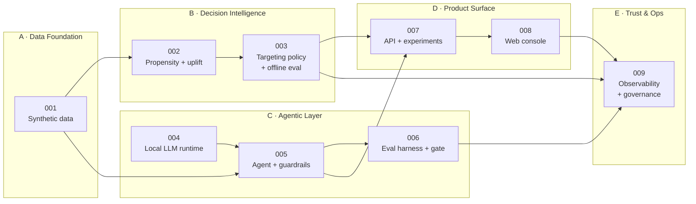
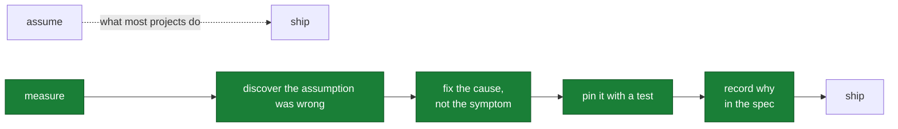

# Part 6 — Build journey

**Written for: you, learning the project.** Previous: [product layer](05-product-layer.md) · Next: [demo and Q&A](07-demo-and-qa.md)

What was built, in what order, and what broke at each stage.

**This is the most valuable part of the guide for an interview.** Anyone can describe a
system that works. Describing the four times it did not, and why the fixes were what they
were, is what demonstrates engineering rather than assembly.

---

## 6.1 The method: spec-driven development

Built with [GitHub Spec Kit](https://github.com/github/spec-kit) (`specify-cli` v1.0.12).

```text
constitution ──once──▶ specify ──▶ clarify ──▶ plan ──▶ tasks ──▶ analyze ──▶ implement ──▶ converge
                                                                                   ▲            │
                                                                                   └────────────┘
```

| artifact | answers |
|---|---|
| `spec.md` | **what** and **why**. No technology. Prioritised user stories, acceptance scenarios, measurable success criteria. |
| `plan.md` | **how**. Technology choices, constitution check, complexity tracking. |
| `tasks.md` | the enumerated, ordered work items |
| `hld` / `lld` | components and contracts; then modules, signatures, algorithms, failure paths |

**Converged** means the code was re-read against the spec and the spec updated to record
what measurement showed. All nine features are converged.

### The constitution

Eight principles, written before any code, that everything else answers to:

| # | principle | what it forced |
|---|---|---|
| I | **Evidence over persuasion** (non-negotiable) | the value ledger; the agent can recommend *against* buying |
| II | **Local-first inference** | no PII egress; free evaluation; the provider abstraction |
| III | **Uplift over propensity** | non-positive uplift excluded unconditionally |
| IV | **Guardrails are code, not prose** | every safety claim is an executable check that can fail CI |
| V | **Every goal metric ships with a counter-metric** | retention guardrail; fairness slices |
| VI | **Reproducible by default** | seeds, fingerprints, one-command regeneration |
| VII | **Spec-driven development** | this trail |
| VIII | **Synthetic data, stated plainly** | the notice on every report, view and chart |

Principle I and the zero-grounding-violation gate may not be weakened by amendment, only
strengthened.

---

## 6.2 Nine features across five domains



Features are grouped into domains so a reviewer can enter at any tier and find a
self-contained slice. Each domain is a coherent discipline with its own failure modes and
its own quality gate.

---

## 6.3 The stages, and what broke at each

### Stage 1 — Data foundation (001)

**Built:** structural causal model, four latent segments, deterministic per-user ledger,
pricing catalog.

**The design decision:** segments shape observable behaviour but are never features. And
ledgers are *derived* from `sha256(user_id)` rather than stored — any user id works,
nothing to keep in sync, no fixture that can drift.

**Outcome:** observed ATE +0.0153 against a true mean τ of +0.0140. Internally consistent.

---

### Stage 2 — Models (002) · **the big failure**

**Built:** shared feature pipeline, propensity model, S/T/X-learners, evaluation suite.

**What broke:** the first uplift estimator **ranked worse than the propensity baseline it
was meant to beat** — Qini 0.5596 against 0.6725, with a *positive* bottom decile.

**Why:** T-learner variance. Outcome-tuned hyperparameters fit a ~15% conversion rate; a
treatment effect is 1–8 pp. Subtracting two such fits compounds their errors. Predicted τ
spanned [−0.346, +0.377] against a true range of [−0.044, +0.135].

**Fix:** regularise the arm models (0.5596 → 0.7533), then move to an X-learner (→ 0.7822)
which regresses imputed effects and *can* be regularised toward zero.

**What makes it credible:** ADR-002 had pre-declared the trigger. The broken variant still
runs as a **live ablation** on every training pass.

**Also corrected here:**
- The operating budget moved 30% → 20% after the budget sweep showed the advantage is
  strongly reach-dependent (+115% at 5%, −7% at 50%).
- Ratio reporting suppressed near a zero denominator, after a near-zero propensity
  baseline produced a headline of **−2577%**.

---

### Stage 3 — Targeting policy (003) · **the spec was wrong**

**Built:** four ordered constraints, the value-fit gate, decision log, fairness
decomposition, IPS/SNIPS/DR/oracle offline evaluation.

**What broke, twice:**

1. **The specification was wrong and the code was right.** Spec 003 required the ungated
   selection to be a strict superset of the gated one. A test written from it failed
   against correct code: suppressing a low-benefit user **frees a budget slot** that
   backfills with the next eligible user. The spec was corrected, the reason recorded in
   place, and `backfilled_by_gate` added as a reported metric.

2. **The parity cap made fairness worse.** It equalised per-band contact *counts*; with
   bands of unequal size that equalises the wrong quantity and **widened** the rate gap it
   was meant to close — 0.064 against 0.040 uncapped. Now caps by rate.

**Outcome:** the value-fit gate is the *binding constraint*. DR interval covers the oracle
for all five candidate policies.

---

### Stage 4 — Local LLM runtime (004)

**Built:** provider protocol, four backends, GBNF grammar generation, validation, bounded
repair loop.

**Validated empirically before building on it:** Qwen2.5-1.5B loads in 1.3 s and sustains
16.4 tok/s on 4 CPU threads, and grammar-constrained tool calls parse cleanly. ADR-001 and
ADR-003 became evidence-backed rather than asserted.

**What broke:**
- The 1.5B model **degenerated into nine repetitions** of one paragraph. Added
  `repeat_penalty` and a tighter answer budget.
- The judge grammar failed to compile — GBNF requires **one rule per logical line**, and a
  multi-line `root` rule parses as a new rule name. Because the judge degrades gracefully,
  every score silently became "unavailable" rather than raising.

---

### Stage 5 — Agent and guardrails (005) · **three real hallucinations**

**Built:** bounded tool loop, session-bound identity, six independent output gates,
evidence provenance, degradation path.

**What broke — all found by running it, not reasoning about it:**

| # | what happened | fix |
|---|---|---|
| 1 | 1.5B model fabricated **seven** dollar figures in one message | all blocked; degraded to the correct templated message. *The system working.* |
| 2 | 1.5B degenerated into nine repetitions — **every safety check passed** because the output was safe and useless | added the coherence gate |
| 3 | 3B model answered from `get_account_summary` alone, claiming **"no significant fees"** for a user with $136.93 | required evidence became a protocol precondition the loop enforces |
| 4 | the advice guardrail blocked **the catalog's own disclaimer** — `/guarantee/` matched "not guarantees of future savings" | checks became negation-aware |

Number 3 is the most instructive: every number it printed was real, and the sentence was
still false. No grounding check catches that.

Number 4 is the one to remember about guardrail design: **a check that fires on negated
text is not conservative, it is broken.** It blocks correct output and trains operators to
ignore it.

---

### Stage 6 — Evaluation harness (006) · **the gate earned its keep on day one**

**Built:** 30 criteria-selected golden cases, programmatic gate, LLM judge with structured
output, provider comparison.

**What broke immediately:** the first run failed the build with a prohibited-advice
refusal rate of **0.00**. Asked about bitcoin, the deterministic writer replied with a
summary of the user's overdraft fees. It had no way to decline at all.

**Fix — architectural, not a patch:** refusal moved into `f2g/agent/scope.py` and is
decided **before any inference**, so every provider declines identically, for free,
without reading the user's account data.

> A refusal that depends on the model cooperating is not a control.

---

### Stage 7 — API and experimentation (007) · **two performance defects**

**Built:** FastAPI service, deterministic assignment, idempotent events, always-valid
analysis, audit and telemetry endpoints.

**What broke:**

1. The per-arm summary query joined assignments to events with `COUNT(DISTINCT CASE WHEN …)`.
   At 45,000 × 59,000 rows it **did not return in ten minutes**. Rewritten as two indexed
   aggregations: **125 ms**.
2. `test_event_idempotency` passed on a clean checkout and failed on every rerun. The
   symptom was an order-dependent test; the **defect was that the suite wrote into
   `data/events.db`** — the same file the demo and console use. `conftest` now redirects to
   a temporary database before `f2g.config` is imported.

---

### Stage 8 — Web console (008) · **what only rendering could catch**

**Built:** three views, hand-built SVG charts, evidence chips, per-check badges.

**What broke — invisible to `tsc`:**

1. **viewBox scaling.** Charts authored in a 560-unit box scaled to a 1200 px card,
   multiplying every font size by ~2.2 and leaving plots swimming in whitespace.
2. **Label anchoring.** The de-collision helper computed spaced label positions and then
   anchored the text at each series' *original* y, silently discarding the spacing. The
   code looked correct and the labels still overlapped.

Both found by screenshotting the running app in both colour schemes. A typecheck cannot
see layout.

---

### Stage 9 — Governance (009) · **the test found the gap**

**Built:** decision and generation audit logs, telemetry aggregation, generated model card,
14-risk register, consent note.

**What broke:** the structural test over the risk register — *every risk must name a
control or an explicit acceptance* — **found a real gap**. There was no risk covering
out-of-scope financial advice, even though `scope.py` existed to control it. Added as R7a.

---

### Stage 10 — Running it on a clean Windows machine · **two hidden bugs**

Not a planned stage. It surfaced two defects that had been invisible on the build machine.

1. **The entire `f2g/data` package was missing from the repository.** `.gitignore` line 11
   was a bare `data/`, which gitignore matches **at any depth** — so it excluded
   `f2g/data/` along with the generated `data/` directory it was meant for.
   `git status` stayed clean the whole time, because ignored files are not reported.

   A fresh clone therefore had no data layer, and the package was reconstructed locally
   against a different contract. `train.py` failed on `ImportError: cannot import name
   'FEATURES'`.

   **Fix:** anchor the patterns — `/data/`, `/artifacts/`, `/models/` — and restore the
   package.

2. **`Path.write_text()` uses the locale encoding.** That is cp1252 on Windows, which
   cannot encode the `→` characters in the generated reports. The pipeline died with
   `UnicodeEncodeError` *after* training had completed. All file I/O now passes
   `encoding="utf-8"` explicitly.

**The lesson:** both bugs were invisible on the machine that wrote the code. Neither a
test suite nor a code review would have found them. Only running on a different machine
did.

---

## 6.4 The seven decisions

Each records the alternatives rejected and what the choice cost.

| ADR | decision | the cost it accepts |
|---|---|---|
| [001](../adr/ADR-001-local-first-inference.md) | Local open-weights inference by default | a 1.5–3B model follows instructions badly; paid down in ADR-003 |
| [002](../adr/ADR-002-uplift-over-propensity.md) | Uplift as the targeting signal | needs randomised data; noisier target; no per-user ground truth in production |
| [003](../adr/ADR-003-runtime-enforced-tool-calling.md) | Tool-call correctness is the runtime's job | we maintain a grammar generator and validator |
| [004](../adr/ADR-004-value-fit-gate.md) | The savings estimate is a hard constraint in targeting | reachable conversion volume falls — 95.3 forgone |
| [005](../adr/ADR-005-sequential-testing.md) | Always-valid sequential inference | ~20% sample-size premium; two numbers to explain |
| [006](../adr/ADR-006-deterministic-provider.md) | The deterministic provider is production, not a mock | two generation paths to maintain |
| [007](../adr/ADR-007-numeric-grounding-ledger.md) | Grounding by value ledger, not by prompt | deliberate false positives on correctly-derived numbers |

---

## 6.5 Specs corrected by their own implementation

Kept in place rather than edited out, because they are the most honest part of the record.

| spec | was | became | why |
|---|---|---|---|
| 002 SC-004 | "≥25% better than propensity at a **30%** budget" | "…at the **configured operating budget**", now 20% | the advantage is reach-dependent; measurement moved the operating point |
| 003 US2 #3 | ungated selection is a **strict superset** of gated | report the difference; new invariants | the gate backfills freed slots — the spec was wrong, the code was right |
| 003 FR-007 | parity caps per-band **share** | caps per-band **rate** | equal counts across unequal bands widened the gap |
| 005 SC-006 | median generation < 20 s | **NOT MET** — measured 62–110 s | recorded, with levers, rather than relaxed |
| 004 US3 #3a | *(new)* | default provider degrades; explicit request still raises | a fresh clone 500'd |

### The one criterion still unmet

**005 SC-006: median generation under 20 seconds.** Measured 62–110 s on both tiers at the
default seven-round budget on CPU.

It is not user-visible today — nudges are generated asynchronously and cached, and the
chat surface shows an honest progress state — but **caching is a mitigation, not a fix**,
and the criterion as written is unmet.

Levers, in order of preference: reduce the round budget now that evidence gathering is
enforced rather than hoped for; move the fast tier to a GPU or an OpenAI-compatible
endpoint (a config change, thanks to the provider abstraction); or accept the latency and
make the asynchronous path explicit in the specification.

**Say this in an interview.** A candidate who volunteers an unmet criterion with its
levers is more credible than one whose every number is green.

---

## 6.6 What the whole journey demonstrates



Every failure in 6.3 follows that lower path:

| failure | cause fixed, not symptom | pinned by |
|---|---|---|
| T-learner worse than baseline | separate hyperparameter sets for outcome vs effect models | live ablation + dispersion test |
| Refusal rate 0.00 | scope moved into the agent | `test_refusal_touches_no_account_data` |
| `$45` blocked | prompt forbids rounding | `test_rounding_is_treated_as_fabrication` |
| Guardrail blocked its own disclaimer | negation-aware checks | `test_disclaimer_is_not_a_guarantee` |
| Model answered without looking | evidence became a precondition | `test_required_evidence_is_always_gathered` |
| Parity cap widened the gap | cap by rate | `test_parity_cap_reduces_the_gap` |
| Suite polluted demo data | isolated test DB | reran the suite twice |

---

## 6.7 Check your understanding

1. Name three defects that only appeared when the code ran somewhere other than where it
   was written.
2. The spec said the gated selection must be a subset of the ungated one. Why was the spec
   wrong?
3. Why is the unregularised T-learner still trained on every pipeline run?
4. What does "a refusal that depends on the model cooperating is not a control" mean
   concretely?
5. One success criterion is unmet. Which, why, and what would you do about it?

---

Next: [Part 7 — Demo and Q&A](07-demo-and-qa.md)
