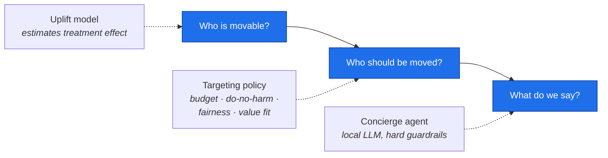

# Learn Free2Genius

**Written for: you — coming to this codebase new, and needing to demo it and defend it in an interview.**

This guide teaches the project from zero. It assumes you know Python and basic ML,
and nothing else about this repository.

> Everything here is reproducible. Every number quoted was produced by running the
> pipeline on this machine, and the command that produces it is shown beside it.
> All data is synthetic — that is stated on purpose and is part of the story.

---

## How to use this guide

Read in order. Each part builds on the one before.

| # | Part | What you get | Time |
|---|---|---|---|
| 1 | [Why this exists](01-why-this-exists.md) | The business problem, why the obvious solution is wrong, the one idea that makes this project distinctive | 20 min |
| 2 | [System architecture](02-architecture.md) | HLD — the pieces, how they connect, one request traced end to end | 25 min |
| 3 | [Decision layer](03-decision-layer.md) | LLD — synthetic data, propensity, uplift, targeting policy, offline evaluation | 45 min |
| 4 | [Agent layer](04-agent-layer.md) | LLD — local LLM runtime, tools, guardrails, evaluation gate | 45 min |
| 5 | [Product layer](05-product-layer.md) | LLD — API, experimentation, console, governance | 30 min |
| 6 | [Build journey](06-build-journey.md) | The nine stages, what broke at each, and why the fixes were what they were | 30 min |
| 7 | [Demo and Q&A](07-demo-and-qa.md) | The ten-minute demo, the questions you will be asked, and how to answer them | 30 min |

Total: about four hours to read properly. Do it over two sessions, not one.

**Do not skip part 6.** The failures are the most interesting content in the project
and the thing an interviewer will find most convincing.

---

## Ten-minute orientation

If you have ten minutes before a call, read only this section.

### What the system does

Free users of a fintech app rarely upgrade to the paid tier (called **Genius**)
because they never see what it would do for them. This system decides **who** to
invite and **what to say** to each person.

Three decisions, three owners:



### The one idea that makes it distinctive

Most growth systems answer "who is most likely to convert?" This one refuses to.

**The agent's grounded savings estimate is a hard constraint inside the targeting
decision.** Before anyone is contacted, the system computes from that user's own
90-day fee history what the subscription would actually save them. If that does not
clear the price, they are suppressed — no matter how movable the model says they are.

The result is structural, not aspirational: **the system cannot hit its conversion
target by pushing users who will not benefit**, because the honesty check sits inside
the decision rather than beside it.

On the live cohort that check is the *binding constraint* — it suppresses 7,530 of
12,000 candidates, more than the budget does.

### The single best demo moment

Two users, both real output from `python run.py all`:

| user | predicted uplift | estimated 90-day saving | Genius cost | decision |
|---|---|---|---|---|
| `l0000715` | 0.115 | $52.59 | $44.97 | **contacted** |
| `l0010925` | 0.113 — *2nd highest of 12,000* | $33.78 | $44.97 | **suppressed** |

And what the agent writes for the second one:

> Over the same 90 days Genius costs $44.97, which is more than the $33.78 it would
> have saved you. On your recent activity it would not pay for itself, so it is
> probably not worth it right now.

An upsell agent that recommends against buying. That is the project in one screen.

### Five numbers to memorise

| | |
|---|---|
| Uplift vs propensity targeting, at the 20% operating budget | **+32.9%** more incremental conversions |
| What propensity targeting spends a 10% budget on | **96.7% sure-things** — users converting anyway |
| Grounding violations reaching a user, across the golden case set | **0** |
| Naive vs always-valid test, dashboard read 200 times under no true effect | **~45%** vs **~2%** false positives |
| Mean estimated saving of contacted users, gate on vs off | **$70.21** vs **$34.75** |

---

## Glossary

Learn these eight terms and most of the codebase reads naturally.

| Term | Plain meaning |
|---|---|
| **Propensity** | Probability this user converts. `P(convert)`. What a conventional model predicts. |
| **Uplift** (also CATE, τ, tau) | How much *contacting* them changes that probability. `P(convert | contacted) − P(convert | not contacted)`. Can be **negative**. |
| **Treatment / control** | Contacted / not contacted. The pilot cohort was split 50/50 at random. |
| **Sleeping dog** | A user whom contact makes *less* likely to convert. Negative uplift. Real in this data at −2.2 pp. |
| **Qini** | The scoring metric for an uplift model. Roughly "how many extra conversions does this ranking capture as you contact more people". AUC does not work here — see part 3. |
| **Value fit** | Estimated 90-day saving for one user, computed in Python from their own fee history. The honesty gate compares it to the subscription price. |
| **Grounding** | Every number the agent writes must have come from a tool result. Enforced by set membership, not by asking the model nicely. |
| **Always-valid / sequential test** | A confidence interval you may look at any number of times without inflating your false-positive rate. |

---

## Repository map

```text
f2g/
├── data/         synthetic population, per-user ledger, pricing catalog
├── ml/           feature pipeline, estimators, evaluation, policy, offline policy eval
├── llm/          provider abstraction, GBNF grammar, validation, repair loop
├── agent/        tools, scope policy, guardrails, the concierge loop
├── evals/        golden cases, LLM judge, the CI gate
├── experiment/   variant assignment, always-valid analysis
├── api/          FastAPI service, event store, telemetry
└── governance/   model card generator
web/              React + TypeScript console
specs/            nine feature specifications, plans, task lists
docs/
├── learn/        this guide
├── architecture/ per-feature HLD and LLD (reference depth)
├── adr/          seven architecture decision records
└── governance/   model card, risk register, consent note
tests/            207 tests
```

51 Python modules, 12 front-end source files, 61 specification and architecture
documents, 207 tests.

### This guide vs the reference docs

They serve different purposes and overlap on purpose:

- **`docs/learn/`** (this guide) teaches you the project as a narrative, in order,
  assuming no prior knowledge.
- **`docs/architecture/hld|lld/`** are reference documents, one per feature,
  written for someone who already knows the system and needs the contract for a
  specific component.
- **`docs/adr/`** records seven decisions with the alternatives that were rejected
  and what each choice cost.
- **`specs/`** is the spec-driven-development trail: what was required, planned, and
  measured, per feature.

Read this guide first. Reach for the others when you need depth on one thing.

---

## Run it before you read further

The guide quotes output. Have it in front of you.

```bash
python run.py setup     # once
python run.py all       # ~4 minutes
python run.py api       # terminal 1 → http://127.0.0.1:8000
python run.py web       # terminal 2 → http://localhost:5173
```

On Windows use `run.bat` instead of `python run.py`.
