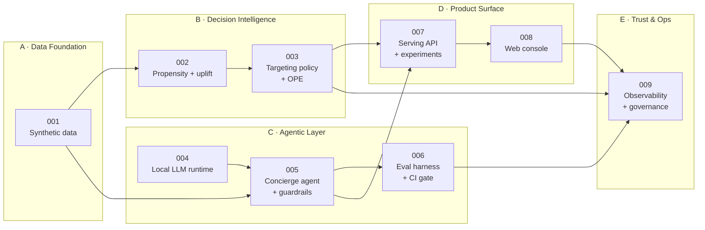

# Specification Index — Free2Genius

Spec-driven development register. Every feature below carries the full GitHub Spec Kit
artifact set and its own architecture documents. Nothing in `f2g/`, `web/`, or `evals/`
exists without a specification here.

> **All data in this project is synthetic.** See `.specify/memory/constitution.md`,
> Principle VIII.

## Why the specs are classified

A single monolithic specification for a system that spans a data generator, two classes
of model, a policy optimizer, an LLM runtime, a safety layer, an HTTP service, a web
console, and an experiment platform would be unreviewable — and would hide the fact that
several of those slices are independently valuable.

Features are therefore grouped into five **domains**. Each domain is a coherent
engineering discipline with its own reviewer, its own failure modes, and its own quality
gate. A reviewer can enter at any tier and find a self-contained slice that delivers
value on its own.

| Domain | Question it answers | Primary risk it owns |
|---|---|---|
| **A — Data Foundation** | What do we know about a user, and is it trustworthy? | Detail and aggregate disagreeing; unreproducible data |
| **B — Decision Intelligence** | Who should we contact, and who must we leave alone? | Optimizing the wrong quantity; harming users |
| **C — Agentic Layer** | What do we say, and can we prove it is true? | Hallucinated financial claims; prompt injection |
| **D — Product Surface** | How does it reach a user, and how do we know it worked? | Unmeasurable rollout; peeking at experiments |
| **E — Trust & Operations** | Would this survive a compliance and fairness review? | Silent unfairness; undocumented models |

## Feature register

| ID | Domain | Feature | Status | Depends on |
|---|---|---|---|---|
| [001](001-synthetic-data-foundation/) | A | Synthetic data foundation | 🔬 Converged | — |
| [002](002-propensity-uplift-models/) | B | Propensity & uplift models | 🔬 Converged | 001 |
| [003](003-targeting-policy-engine/) | B | Targeting policy engine & offline policy evaluation | 🔬 Converged | 002 |
| [004](004-local-llm-runtime/) | C | Local LLM runtime & provider abstraction | 🔬 Converged | — |
| [005](005-concierge-agent-guardrails/) | C | Genius concierge agent & safety guardrails | 🔬 Converged | 001, 004 |
| [006](006-agent-evaluation-harness/) | C | Agent evaluation harness & CI gate | 🔬 Converged | 005 |
| [007](007-serving-api-experimentation/) | D | Serving API & experimentation platform | 🔬 Converged | 003, 005 |
| [008](008-web-console/) | D | Web console: nudge, chat, experiment dashboard | 🔬 Converged | 007 |
| [009](009-observability-governance/) | E | Observability, cost control & AI governance | 🔬 Converged | 002–008 |

Status legend: 📋 Specified · 🏗 In progress · ✅ Implemented · 🔬 Converged (spec ⇄ code verified)

All nine features are converged: implemented, tested, and with their specifications updated to
record what measurement actually showed — including the criteria that were **revised** (002
SC-004, 003 US2) and the one that is **not met** (005 SC-006, generation latency).

## Dependency graph



## The one non-obvious edge

`003 → 005` is the coupling that makes this system more than two projects in one
repository, and it runs in both directions:

- The **policy** decides who is eligible for contact.
- The **agent** computes, from that user's own fee history, what Genius would actually
  save them.
- That grounded estimate is fed **back** into the policy as a hard eligibility
  constraint: a user whose estimated saving does not clear the subscription price is
  suppressed, no matter how high their predicted uplift.

The consequence is structural rather than aspirational. The system cannot hit its
conversion target by pushing users who will not benefit, because the honesty check sits
*inside* the targeting decision rather than beside it. See
[ADR-004](../docs/adr/ADR-004-value-fit-gate.md).

## Per-feature artifact set

```text
specs/NNN-feature-name/
├── spec.md          # WHAT and WHY. No technology. (/speckit-specify)
├── clarify.md       # Resolved ambiguities, with the decision taken (/speckit-clarify)
├── plan.md          # HOW. Technology choices and justification. (/speckit-plan)
├── research.md      # Options considered, benchmarks, rejected alternatives
├── data-model.md    # Entities, schemas, invariants
├── contracts/       # Interface contracts (OpenAPI, JSON Schema, Python protocols)
├── tasks.md         # Enumerated, ordered work items (/speckit-tasks)
└── checklist.md     # Requirement-quality gate (/speckit-checklist)
```

Architecture documents live outside the spec tree so they can be read as one system:

```text
docs/architecture/
├── system-context.md      # C4 L1 + L2: the whole system on one page
├── hld/NNN-*.md           # High-level design per feature: components, contracts, flows
└── lld/NNN-*.md           # Low-level design per feature: modules, signatures, failures
docs/adr/                  # Architecture Decision Records — the "why" with the rejected options
docs/governance/           # Model card, risk register, fairness audit
docs/demo/                 # Demo script and walkthrough
```

## Process

```text
constitution ──once──▶ specify ──▶ clarify ──▶ plan ──▶ tasks ──▶ analyze ──▶ implement ──▶ converge
                                                                                   ▲            │
                                                                                   └────────────┘
```

`analyze` is a cross-artifact consistency check run before implementation; `converge`
re-reads the codebase against spec and tasks after implementation and appends whatever
remains. A feature reaches 🔬 Converged only when `converge` reports no outstanding work.
